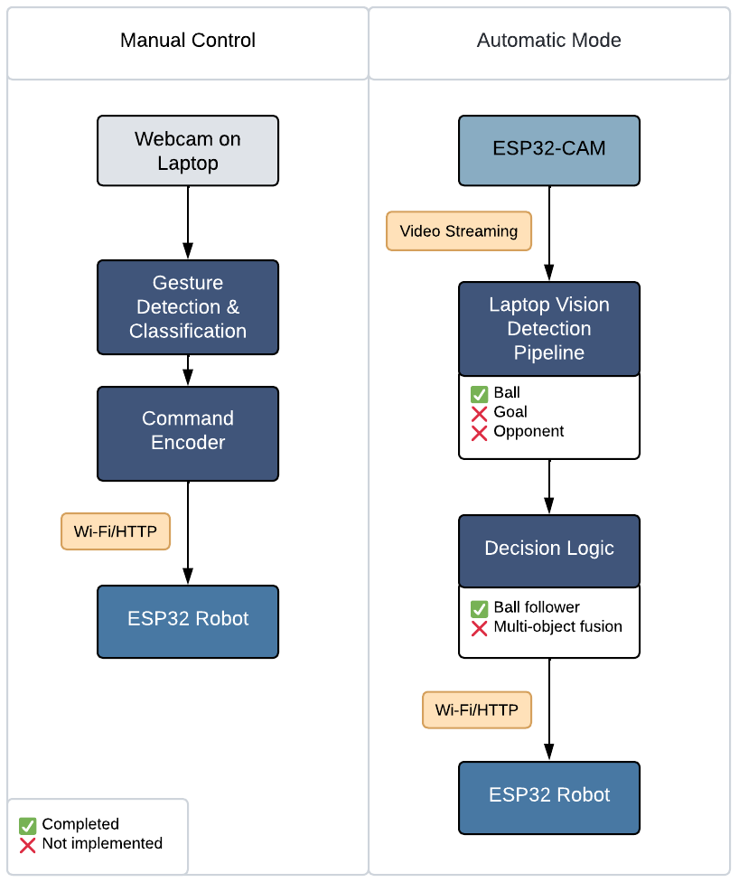

# Auto Soccer Bot — ESP32 Robot Footballer 🤖⚽️

[English](#-english) · [Español](docs/es/index.md) · [Français](docs/fr/index.md)

> ESP32-powered robot that plays football in **two modes** — **manual** hand-gesture control and **automatic** ball following with on-laptop vision.

---

## 🇬🇧 English

### Introduction
This project is a **robot football player controlled by an ESP32**. It operates in two modes:

- **Manual Control** — A webcam detects **hand gestures** on the laptop; the laptop interprets the gesture and **sends commands to the ESP32** to drive the robot.
- **Automatic Mode** — The ESP32-CAM streams video to a laptop which performs **object detection** (ball, goal, opponent) and **sends movement commands** (forward, left, right, backward) back to the robot.

> **Current status:** We completed **ball following** (detection + decision making) and trained an **opponent detector**. We did **not** finish the **goal detector** or the **multi-object decision fusion** (opponent + goal).

---

## Table of Contents

- 📚 **Documentation (multi-language)**
  - 🇬🇧 [Docs — EN](#)
  - 🇪🇸 [Docs — ES](docs/es/index.md)
  - 🇫🇷 [Docs — FR](docs/fr/index.md)
- 🧭 [**How it works**](docs/en/how-it-works.md)
  - [ESP32-CAM robot — Architecture & Operation](docs/en/esp32cam_robot.md)
  - [Manual control — Architecture & Operation](docs/en/manual_control)
- 🗂️ [**Repository structure**](docs/en/repository-structure.md)
- 🧪 **Project status**
- 🚀 **Quick start**
- ⚙️ **Components**
  - Firmware (ESP32-CAM): [`/esp32cam_robot`](esp32cam_robot/README.md)
  - Manual control (gestures): [`/manual_control`](manual_control/)
  - Automatic mode (vision + control): [`/auto_soccer_bot`](auto_soccer_bot/)
  - Opponent detector training: [`/opponent-detector`](opponent-detector/README.md)
- 📄 **License**

---
## How it works

  

**Figure 1.** System architecture and data flow for the Auto Soccer Bot (ESP32) in manual and automatic modes.