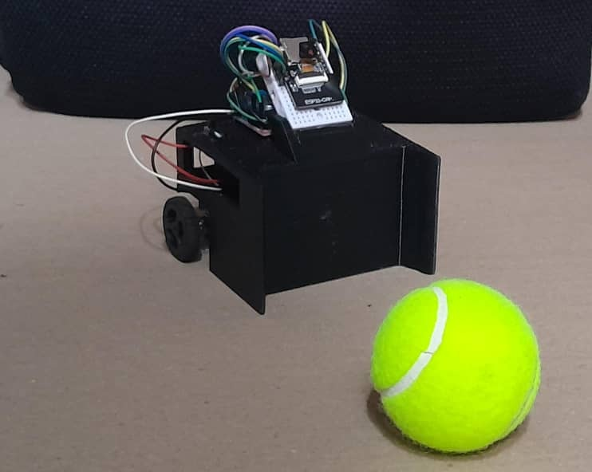
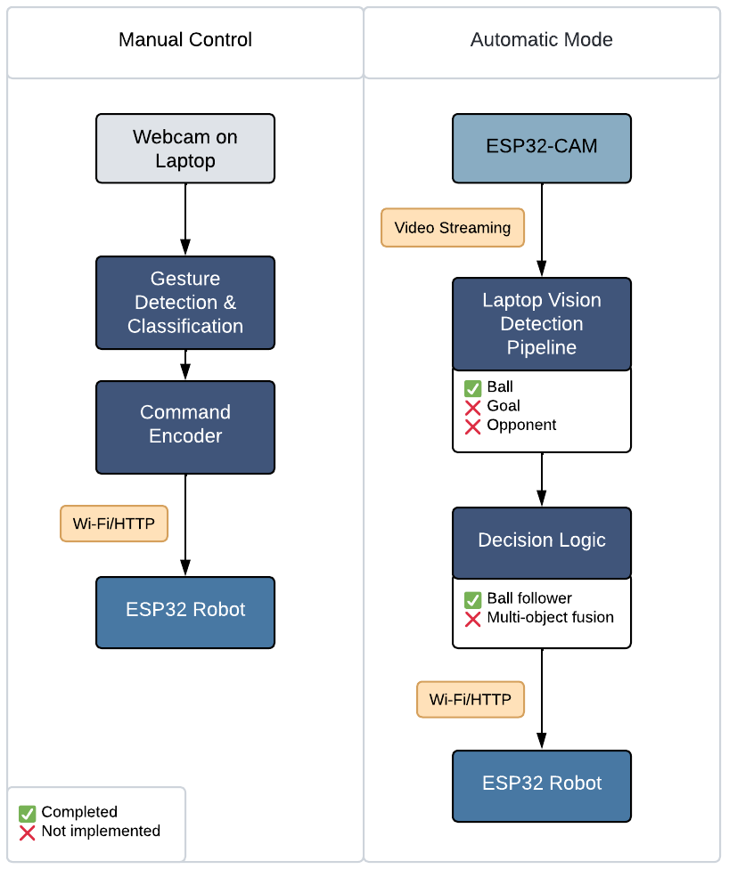

# Auto Soccer Bot — ESP32 Robot Footballer 🤖⚽️

[English](#-english) · [Español](docs/es/README.md) · [Français](docs/fr/README.md)

> ESP32-powered robot that plays football in **two modes** — **manual** hand-gesture control and **automatic** ball following with on-laptop vision.

  

---

## 🇬🇧 English

### Introduction
This project is a **robot football player controlled by an ESP32**. It operates in two modes:

- **Manual Control** — A webcam detects **hand gestures** on the laptop; the laptop interprets the gesture and **sends commands to the ESP32** to drive the robot.
- **Automatic Mode** — The ESP32-CAM streams video to a laptop which performs **object detection** (ball, goal, opponent) and **sends movement commands** (forward, left, right, backward) back to the robot.

> **Current status:** We completed **ball following** (detection + decision making) and trained an **opponent detector**. We did **not** finish the **goal detector** or the **multi-object decision fusion** (opponent + goal).

---

## Table of Contents

- 📚 **Documentation (multi-language)**
  - 🇬🇧 [Docs — EN](#)
  - 🇪🇸 [Docs — ES](docs/es/README.md)
  - 🇫🇷 [Docs — FR](docs/fr/README.md)
- 🤖 **Simulation (ROS 2 + Gazebo)**
  - 🇬🇧 [Simulation — EN](simulation/README.md)
  - 🇪🇸 [Simulation — ES](simulation/docs/es/README.md)
  - 🇫🇷 [Simulation — FR](simulation/docs/fr/README.md)
- ⚙️ [**How it works**](docs/en/how-it-works.md)
  - [ESP32-CAM robot — Architecture & Operation](docs/en/esp32cam_robot.md)
  - [Manual control — Architecture & Operation](docs/en/manual_control.md)
  - [Automatic mode — Architecture & Operation](docs/en/auto_soccer_bot.md)
  - [Soccer Vision — Architecture & Operation](docs/en/soccer_vision.md)
  - [API & Communication Protocols](docs/en/api-communication-protocols.md)
- 🗂️ [**Repository structure**](docs/en/repository-structure.md)
- 🔌 [**Hardware & Power — Electronics & Wiring Guide**](docs/en/hardware-power.md)
- 🧪 [**Project status**](docs/en/project_status.md)
- 🚀 [**Quick start**](docs/en/quick_start.md)
- 🎯 [**Conclusion, Results & Challenges**](docs/en/conclusion.md)
- 📄 [**License: MIT license**](LICENSE)

---
## How it works

  

**Figure 1.** System architecture and data flow for the Auto Soccer Bot (ESP32) in manual and automatic modes.