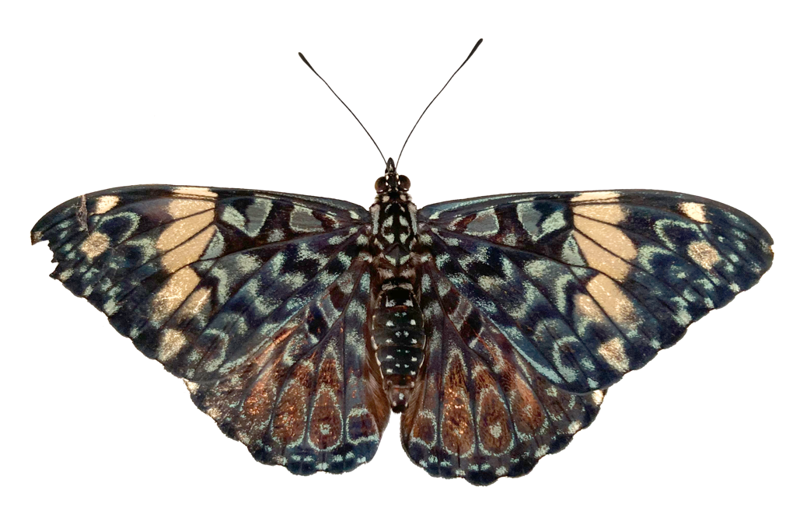
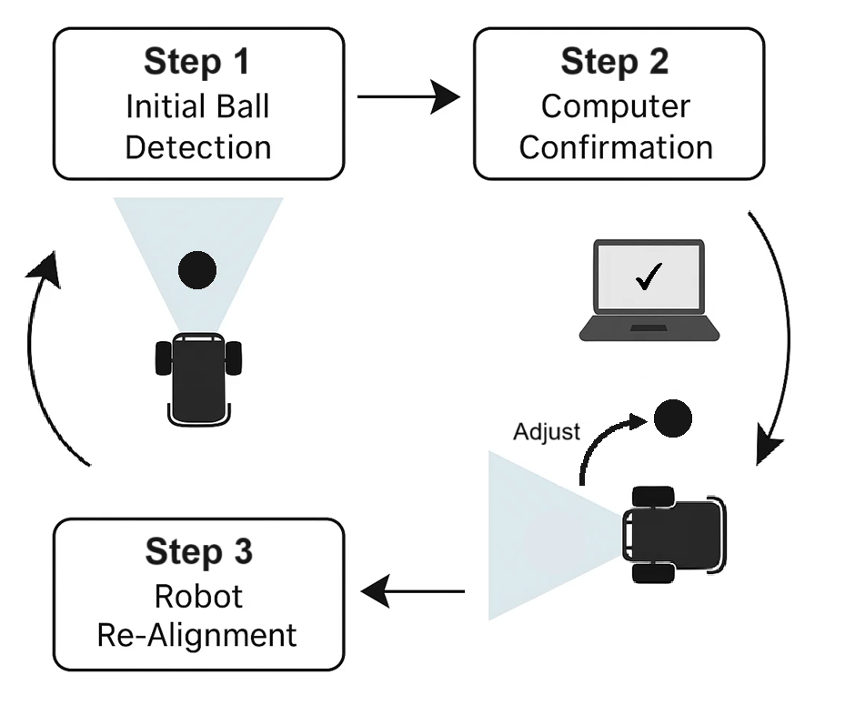

## Automatic mode (`auto_soccer_bot/`) — Architecture & Operation

### Index
- [What this module does](#what-this-module-does)
- [Pipeline](#pipeline)
- [Languages & runtime](#languages--runtime)
  - [Core libraries (OpenCV · HTTPX · YOLO)](#core-libraries-opencv--httpx--yolo)
- [Challenges encountered](#challenges-encountered)
- [Folder structure (high level)](#folder-structure-high-level)
- [File responsibilities (summary)](#file-responsibilities-summary)
- [Installation](#installation)

### What this module does
Its purpose is to enable the robot to manage itself autonomously in order to score goals, identify opponents on the field, and operate as part of a multi-robot system. Each robot is autonomous and can detect and follow the ball, carry it to the goal, and recognize opponents.

--- 
### Pipeline

1) **Stream intake (ESP32 → laptop)**
   - **Protocol:** MJPEG over HTTP at **`http://<ESP32_IP>:81/stream`** (`multipart/x-mixed-replace`).
   - **Reader:** `httpx.AsyncClient.stream("GET", ESP32_STREAM_URL)` with **no read timeout** and a **connect timeout** from `config_auto` (see `HTTP_TIMEOUT_CONNECT`).  
   - **Frame geometry:** We preserve the native stream size (**QVGA 320×240** by default per firmware). An optional resize is commented in code if you want to trade spatial detail for compute.

2) **Perception (hybrid ball detection)**
   - **Why YOLO + color?**  
     - **YOLO (learning-based)** is robust to shape/lighting variation, partial occlusions, and non-ideal colors, but is heavier per frame.  
     - **HSV color (rule-based)** is **very fast** and reacts every frame, but is sensitive to illumination and background hues.  
     - Combining them yields **responsiveness (color)** + **robustness (YOLO)**: we schedule YOLO **every N frames** and fall back to color on the rest.
   - **YOLO (Ultralytics)**
     - Runs every **`DETECTION_INTERVAL`** frames (default **6**).  
     - Targets are filtered by `TARGET_CLASS_NAMES` (e.g., `"sports ball"`) with threshold `DETECTION_CONFIDENCE_THRESHOLD`.  
     - Results are cached with a short **TTL** (`yolo_ttl_frames = max(DETECTION_INTERVAL*2, 3)`) to stabilize between YOLO passes.
   - **Color detection**
     - **HSV thresholding** with `LOWER_BALL_COLOR` / `UPPER_BALL_COLOR` isolates tennis-ball yellow/green.  
     - Light **morphology** (blur + open/close) reduces speckle noise; **min contour area** filters tiny blobs.  
     - **Optional saturation/brightness boosts** (`SATURATION`, `BRIGHTNESS`) are applied in HSV to improve color separability under dull lighting.
   - **Unification**
     - Both detectors emit a common `(center_x, center_y, area)` representation.  
     - **Priority rule:** use **YOLO** if its cached result is **valid**, otherwise use **color**, else **None**.

3) **Decision (finite-state control)**
   - States: **SEARCHING → BALL_DETECTED → APPROACHING → CAPTURED**.  
   - Target corridor enforces horizontal centering: `[TARGET_ZONE_X_MIN=0.30, TARGET_ZONE_X_MAX=0.70] * frame_width`.  
   - In `APPROACHING_BALL`, steering uses **soft turns** (`turn_ratio = APPROACH_TURN_RATIO`) when the ball is left/right of the corridor; otherwise **forward**.  
   - Confirmation counters (`BALL_CONFIRMATION_THRESHOLD`) and grace timeouts (`MAX_ADJUSTMENT_TIMEOUT_MS`, `BALL_LOST_TIMEOUT_MS`) curb oscillations and flapping.

4) **Actuation (laptop → ESP32)**
   - JSON `POST` to **`http://<ESP32_IP>:80/move`** with payload:  
     ```json
     {"direction": "...", "speed": <0-255>, "turn_ratio": 0.0-1.0}
     ```  
   - The communicator **deduplicates** repeated commands and applies **rate limits** (`MIN_TIME_BETWEEN_ANY_COMMAND_MS`, `COMMAND_SEND_INTERVAL_MS`) to avoid saturating the robot.

> **Frame size / image quality:** Firmware streams **QVGA (320×240)** JPEG by default (`FRAMESIZE_QVGA`, `set_quality(30)` in ESP32 `CameraController.h`). 

---


### Languages & runtime
- **Language:** Python 3.10+ (tested with 3.11)
- **Network I/O:** HTTP — stream at `http://<ESP32_IP>:81/stream`, commands at `http://<ESP32_IP>:80/move`

#### Core libraries (OpenCV · HTTPX · YOLO)

<p align="center">
  <!-- Place your logos if desired -->
  
  
  
</p>

- **OpenCV** — JPEG decode, visualization overlays, light pre/post-processing.  
- **HTTPX (async)** — robust stream intake (chunked MJPEG) and command POSTs to `/move`.  
- **YOLO (Ultralytics)** — object detection; several weights provided (YOLOv8/YOLO11). Used together with HSV color detector for resilient ball finding.

---

### Challenges encountered (expanded)

**1) Streaming latency → decision lag**  
- **Before:** Using OpenCV URL capture introduced internal buffering and occasional blocking reads on the MJPEG stream, causing command reactions to feel “behind” the video (queue build-up).  
- **Fixes:**  
  - Switched intake to **HTTPX** with explicit boundary parsing and **latest-frame only** retention (drop old frames).  
  - Kept firmware at **QVGA** with moderate JPEG quality to reduce network+decode cost.  
  - Throttled heavy perception by running **YOLO and Color detection every `DETECTION_INTERVAL` frames** to eliminate pending images stack.
- **Outcome:** Noticeably **snappier control**, fewer bursts of stale frames, and smoother motion during ball tracking.

**2) Stream stability (timeouts, backpressure, Wi-Fi hiccups)**  
- **Before:** The capture loop could stall or accumulate unread data when Wi-Fi jittered.  
- **Fixes:**  
  - **HTTPX** streaming with a dedicated async task and **connect timeout**; **no read timeout** to support long-running streams.  
  - Robust header parsing (`Content-Length`) with resync when malformed parts appear; bounded buffer trimming.  
- **Outcome:** **Higher resilience** to intermittent drops and faster recovery without restarting the app.

**3) Perception robustness vs. speed**  
- **Before:** Running YOLO on every frame was CPU/GPU heavy; running only color was brittle under lighting changes or clutter.  
- **Fixes:**  
  - **Hybrid detector:** YOLO scheduled + **HSV color every frame**; mild HSV **saturation/brightness boosts** (`SATURATION=3.5`, `BRIGHTNESS=1`), morphology, and **min-area** filtering.  
  - Unified output `(cx, cy, area)` so the controller remains agnostic to the source.  
- **Outcome:** **Stable detections** with **lower compute**, maintaining responsiveness while handling lighting/background variation better.

**4) Heading alignment & oscillations**  
- **Before:** A naive left/right pivot on instantaneous x-error caused jitter and state flapping when the ball crossed center.  
- **Fixes:**  
  - Introduced a **finite-state machine** with **confirmation counters** (`BALL_CONFIRMATION_THRESHOLD`) and **grace timeouts** (`MAX_ADJUSTMENT_TIMEOUT_MS`, `BALL_LOST_TIMEOUT_MS`).  
  - Used a **target corridor** `[TARGET_ZONE_X_MIN, TARGET_ZONE_X_MAX]` and **soft turns** with `APPROACH_TURN_RATIO` to smooth corrections.  
- **Outcome:** **Reduced oscillation**, more deliberate transitions, and steadier approach behavior.

<p align="center">
  
</p>

**5) Command flooding of the ESP32**  
- **Before:** Rapidly repeated identical commands wasted bandwidth and CPU on the microcontroller.  
- **Fixes:**  
  - **Dedup + rate limiting** in `RobotCommunicator` using `MIN_TIME_BETWEEN_ANY_COMMAND_MS` and `COMMAND_SEND_INTERVAL_MS`; track last `{direction, speed, turn_ratio}`.  
- **Outcome:** **Lower control-plane noise** and more predictable actuation timing.

**6) Model/asset portability**  
- **Consideration:** YOLO weights are large and may differ across hosts.  
- **Practice:** Keep multiple weights in `models/` (e.g., `yolov11s.pt` for CPU) and select via `config_auto.YOLO_MODEL_PATH`. Use Git LFS or an artifact store when needed.

---

### Folder structure (high level)
```

auto_soccer_bot/
├─ application.py              # Orchestrates async loop: intake → detect → decide → command → visualize
├─ ball_detector.py            # Hybrid detector: YOLO (Ultralytics) + HSV color fallback
├─ camera_manager.py           # HTTPX MJPEG stream reader (port 81 /stream) + optional webcam
├─ config_auto.py              # IP/ports, stream URL, thresholds, HSV ranges, controller gains
├─ detection_manager_base.py   # Abstract detector interface
├─ robot_controller.py         # FSM for ball following & alignment
├─ robot_communicator.py       # Async HTTP client posting JSON commands to /move (port 80)
├─ main.py                     # Entry point (`python -m auto_soccer_bot.main`)
├─ requirements.txt            # Deps: httpx, opencv-python, ultralytics, numpy, …
└─ models/
    ├─ yolo11l.pt
    ├─ yolo11m.pt
    ├─ yolo11n.pt
    ├─ yolo11s.pt
    └─ yolov8n.pt

````

---

### File responsibilities (summary)

| Path | Kind | Principal purpose | Key elements & endpoints | Notes |
|---|---|---|---|---|
| `application.py` | Orchestrator | Starts components; runs the async loop; overlays debug UI | Flow: **`CameraManager.get_frame()` → `BallDetector.process_frame()` → `RobotController.decide_action()` → `RobotCommunicator.send_command()`** | Color enhancement via `enhance_frame_colors()` when streaming; detection scheduled with `DETECTION_INTERVAL`. |
| `ball_detector.py` | Perception | **Hybrid ball detection**: YOLO every N frames + **HSV color** each frame | YOLO weights from `config.YOLO_MODEL_PATH`; targets `TARGET_CLASS_NAMES`; HSV thresholds `LOWER_BALL_COLOR`/`UPPER_BALL_COLOR` | Unified `(cx, cy, area)` output; draws bbox/circle; auto-selects CPU/GPU; maintains YOLO TTL cache. |
| `camera_manager.py` | Stream intake | **HTTPX** MJPEG reader for ESP32 stream | **Stream URL:** `config.ESP32_STREAM_URL` → **`http://<ESP32_IP>:81/stream`**; boundary `--123456789000000000000987654321` | Keeps only the **latest** decoded frame to cut latency; optional resize is commented; webcam mode supported. |
| `robot_controller.py` | Decision | FSM: **SEARCHING → BALL_DETECTED → APPROACHING → CAPTURED** | Corridor `[TARGET_ZONE_X_MIN, TARGET_ZONE_X_MAX]`; speeds `SEARCH_TURN_SPEED`, `APPROACH_SPEED`, `DRIBBLE_SPEED`; turn ratio `APPROACH_TURN_RATIO` | Uses confirmation window & grace timeouts (`BALL_CONFIRMATION_THRESHOLD`, `MAX_ADJUSTMENT_TIMEOUT_MS`). |
| `robot_communicator.py` | Transport | Posts JSON commands; dedups & rate-limits | **Control endpoint:** `config.ESP32_MOVE_ENDPOINT` → **`http://<ESP32_IP>:80/move`**; payload `{"direction","speed","turn_ratio"}` | Rate guards: `MIN_TIME_BETWEEN_ANY_COMMAND_MS`, `COMMAND_SEND_INTERVAL_MS`. |
| `config_auto.py` | Config | Central runtime parameters | Source `VIDEO_SOURCE` (`esp32_httpx`/`webcam`), HSV & color boost, YOLO path, controller gains/thresholds | Defaults: **QVGA** stream, `SATURATION=3.5`, `BRIGHTNESS=1`, `DETECTION_INTERVAL=6`. |
| `detection_manager_base.py` | Abstraction | Interface for detectors | `initialize()`, `process_frame()`, `get_detection_data()` | Enables future goal/opponent detectors. |
| `main.py` | Entry | Launch via `asyncio.run(start_auto_application())` | — | Comments mention env name **`venv_auto_soccer`**; keep doc/scripts consistent. |
| `requirements.txt` | Deps | Runtime packages | `httpx`, `opencv-python`, `ultralytics`, `numpy`, … | If using GPU, ensure compatible CUDA/cuDNN for Ultralytics. |
| `models/*.pt` | Assets | YOLO weights | yolo11*, yolov8n | Prefer lighter models on CPU-limited hosts. |

---

### Installation

**Prerequisites**
- Python **3.10+** (recommended 3.11)
- ESP32 robot reachable on your LAN and streaming at `http://<ESP32_IP>:81/stream`

**1) Create and activate the environment (`venv_auto_soccer`)**

> Run these from the **repository root** (parent of `auto_soccer_bot/`).

**Linux/macOS**
````bash
python3 -m venv auto_soccer_bot/venv_auto_soccer
source auto_soccer_bot/venv_auto_soccer/bin/activate
````

**Windows (PowerShell)**

````powershell
py -3 -m venv auto_soccer_bot\venv_auto_soccer
.\auto_soccer_bot\venv_auto_soccer\Scripts\Activate.ps1
````

**2) Install dependencies**

````bash
pip install -r auto_soccer_bot/requirements.txt
````

**3) Configure**

* Edit `auto_soccer_bot/config_auto.py`:

  * Set `ESP32_IP_ADDRESS = "..."` and adjust ports if needed.
  * Select YOLO weights under `models/` and thresholds.
  * Tune controller gains, target corridor, and (optionally) resize in intake.

**4) Run (from the repository root)**

````bash
python -m auto_soccer_bot.main
````

* A debug window (optional) can display detections and steering info.
* Logs show frame timing, chosen command, and HTTP responses.