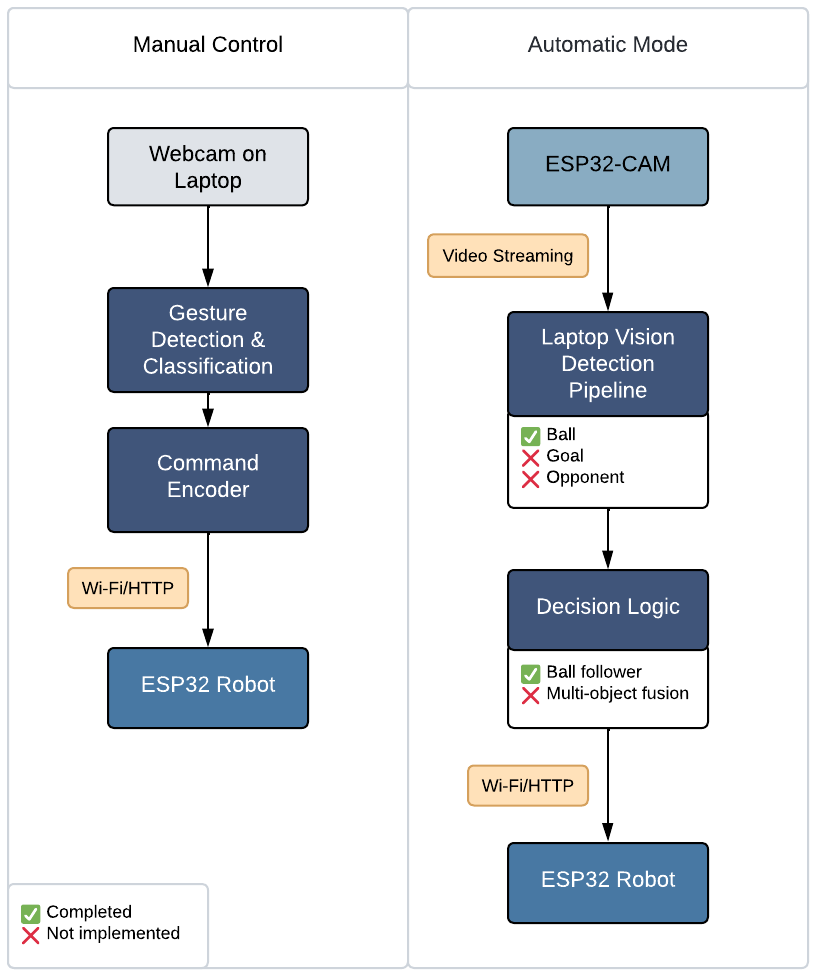

## How it works

This section details the end-to-end dataflow and control loops for **Manual Control** and **Automatic Mode**, as summarized in **Figure 1**. The overall architecture follows a **sense → interpret → command → act** cycle, where the **laptop** provides perception/decision modules and the **ESP32** executes low-level actuation.

### 1) Manual Control (gesture-driven teleoperation)

**Objective.** Enable a user to steer the robot using hand gestures captured by a laptop webcam.

**Pipeline.**
1. **Sensing — Webcam on laptop.** RGB frames are captured at the camera’s native resolution and streamed to the local process.
2. **Perception — Gesture detection & classification.** Each frame is preprocessed and fed to the gesture pipeline to infer a discrete command class (e.g., *forward*, *left*, *right*, *backward*, *stop*).
3. **Decision/Encoding — Command encoder.** The predicted gesture is mapped to motion primitives (linear/angular set-points) and encoded as HTTP requests.
4. **Actuation — ESP32 robot.** Commands are sent over **Wi-Fi/HTTP** to the ESP32, which parses the payload and updates motor PWMs via the motor driver.

**Notes.**
- This loop is **fully implemented** and runs in real time on commodity laptops.
- Communication is stateless request/response; rate limiting and debouncing on the laptop prevent command saturation.

  

**Figure 2.** Example overlay from the gesture pipeline showing detected hand keypoints used for manual teleoperation.

---

### 2) Automatic Mode (vision-in-the-loop autonomy)

**Objective.** Close the perception-to-control loop using a vision stack on the laptop fed by the ESP32-CAM stream.

**Pipeline.**
1. **Sensing — ESP32-CAM (video streaming).** The ESP32-CAM exposes an MJPEG (or equivalent) stream over Wi-Fi.
2. **Perception — Laptop vision detection pipeline.** The laptop subscribes to the stream and performs object detection to localize:
   - **Ball** — ✓ implemented (detector operational).
   - **Goal** — ✗ not implemented.
   - **Opponent** — ✗ model trained but **not integrated** into the live pipeline.
3. **Decision — Controller / decision logic.**
   - **Ball follower** — ✓ implemented (turn-toward/advance based on ball image pose).
   - **Multi-object fusion** (ball + goal + opponent) — ✗ not implemented.
4. **Actuation — ESP32 robot.** The chosen motion is encoded as HTTP commands and transmitted to the ESP32, which updates motor outputs accordingly.

**Notes.**
- Current autonomy is **single-target following** (ball). Without goal/opponent fusion, behaviors such as shot alignment or collision avoidance are not yet available.
- Perception and actuation are decoupled, allowing later upgrades (e.g., quantized models) without firmware changes.

  

**Figure 3.** Instance of the ball detector and controller state during automatic operation (left vertical line marks image center; ‘Cmd’ shows the issued motion).

---

### Component responsibilities (at a glance)

| Layer         | Component                 | Responsibility                                                  | Status                  |
|---------------|---------------------------|------------------------------------------------------------------|-------------------------|
| Sensing       | ESP32-CAM / Laptop webcam | Video capture                                                    | ✓                       |
| Perception    | Laptop vision pipeline    | Detect ball (✓), goal (✗), opponent (✗ integration)             | Partial                 |
| Decision      | Controller on laptop      | Ball-follower (✓); multi-object fusion (✗)                      | Partial                 |
| Communication | Wi-Fi/HTTP                | Command transport (laptop → ESP32)                              | ✓                       |
| Actuation     | ESP32 robot firmware      | Parse commands; motor PWM control                                | ✓                       |

**Legend:** ✓ Completed ✗ Not implemented

---

  

**Figure 1.** System architecture and data flow for the Auto Soccer Bot (ESP32) in manual and automatic modes.