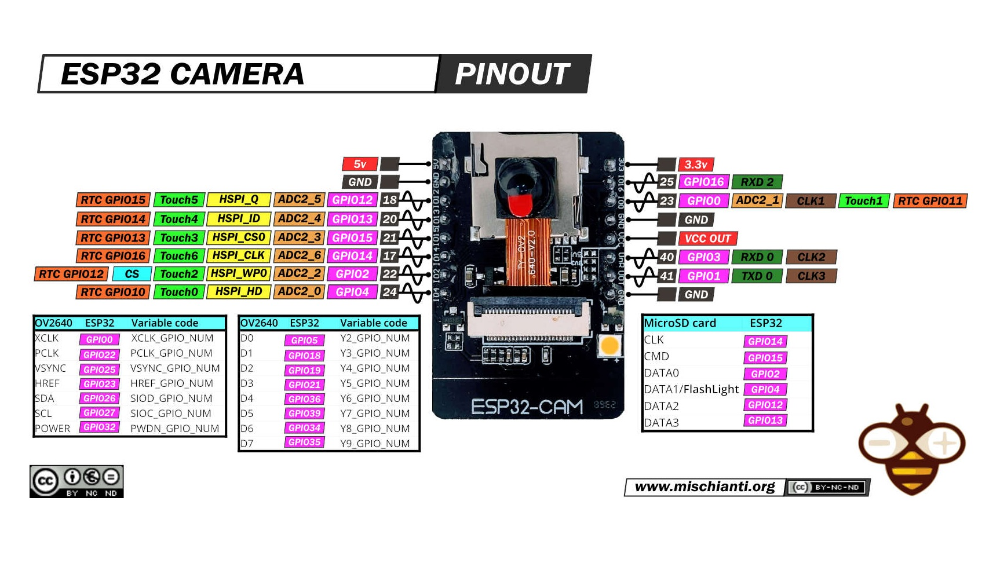
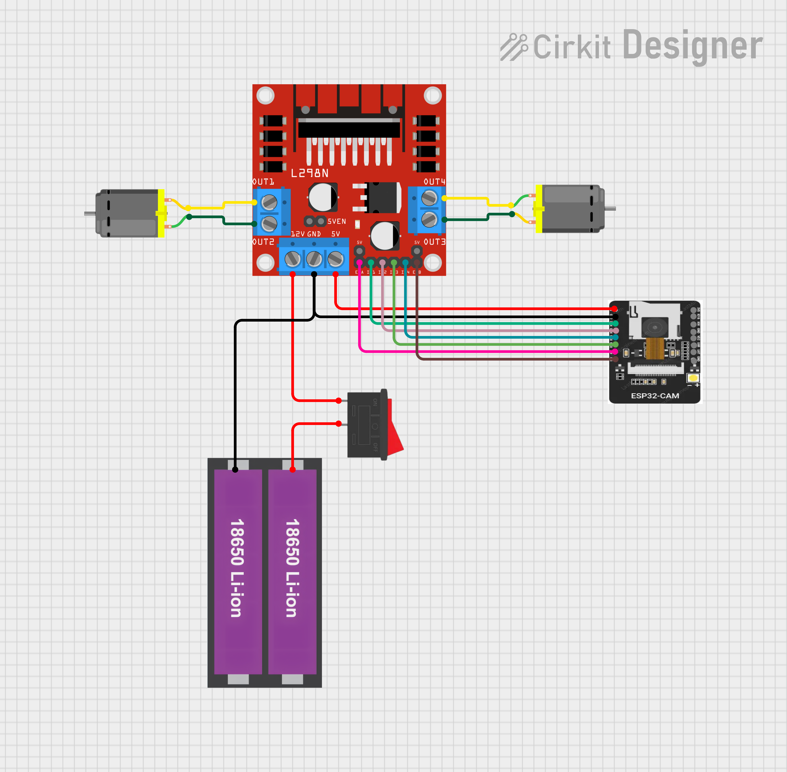
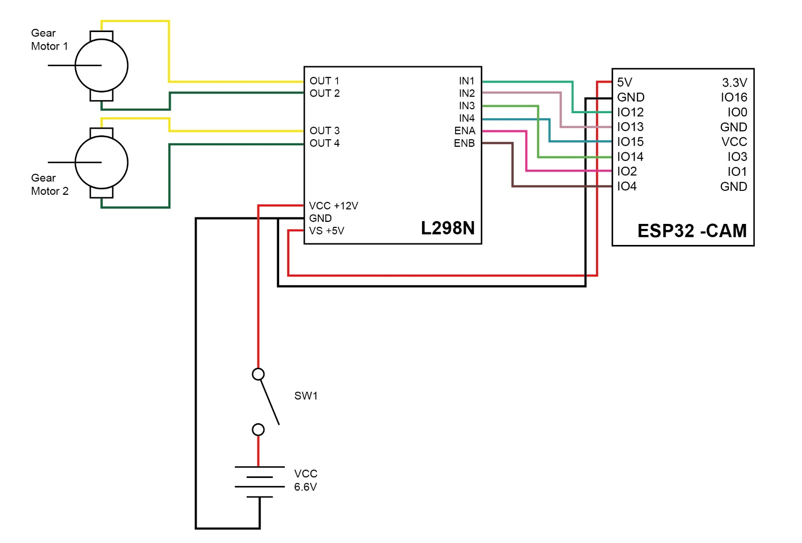

# 🔌 Hardware & Power — Electronics & Wiring Guide

## Table of Contents
- [List of Components](#list-of-components)
- [Circuit Design Layout](#circuit-design-layout)
- [Connections & Topology](#connections--topology)

---

## List of Components

### ESP32-CAM (AI-Thinker)
- **Role:** On-board camera + Wi-Fi; hosts HTTP servers and motor endpoints.
- **Power:** **5 V** on the **5V** pin (now sourced from the **L298N 5 V regulator output**).

  

### L298N Dual H-Bridge Motor Driver
- **Role:** Drives two DC motors and fans-out power.
- **Motor supply (VIN/Vs):** board-dependent; typically **≥ 7–12 V** for the onboard **5 V regulator** to work.
- **Logic:** 5 V (provided by the L298N’s onboard 5 V regulator when the **5V-EN** jumper is installed).

> We will **power the ESP32-CAM from the L298N 5 V output** (see wiring).

### Two DC Gear Motors
- **Rated voltage:** **6 V**
- **No-load speed:** **≈ 360 rpm**
- **Shaft Ø:** **3 mm**
- **Motor Ø:** **12 mm**
- **Body length (no shaft):** **≈ 26 mm**
- **Output shaft axial length:** **≈ 10 mm** (flat ≈ 4.4 mm)
- **Stall torque:** **≈ 16 kgf·cm**
- **Running torque:** **≈ 2 kgf·cm**
- **Weight:** **≈ 0.010 kg**
- **Motor size:** **≈ 36 × 12 mm**
- **Shaft size:** **≈ 3 × 2.5 mm** (D×L)

### Battery Pack
- **Chemistry / Voltage:** **Lithium, 3.3 V** (capacity not specified)

> **Important:** The L298N’s 5 V regulator **requires VIN ≥ ~7 V** to produce a stable 5 V.  

---

## Circuit Design Layout

  
   <em>Figure A — Circuit overview</em>

  
   <em>Figure B — Wiring diagram (ESP32-CAM powered from L298N 5 V)</em>

---

## Connections & Topology

- **Battery → L298N VIN (motor supply) via SW1.**  
  The L298N’s onboard regulator produces **5 V** when VIN is high enough and **5V-EN** is jumpered.
- **L298N 5 V → ESP32-CAM 5V.**  
  The ESP32-CAM is powered directly from the L298N’s **5 V OUT** (as shown in Figure B).
- **Common GND:** Battery **GND**, **L298N GND**, and **ESP32-CAM GND** are tied together.
- **Motors:** connect to **OUT1/OUT2** and **OUT3/OUT4** on L298N.
- **Control lines:** ESP32-CAM GPIOs → **IN1–IN4** (+ **ENA/ENB** for PWM) on L298N.
