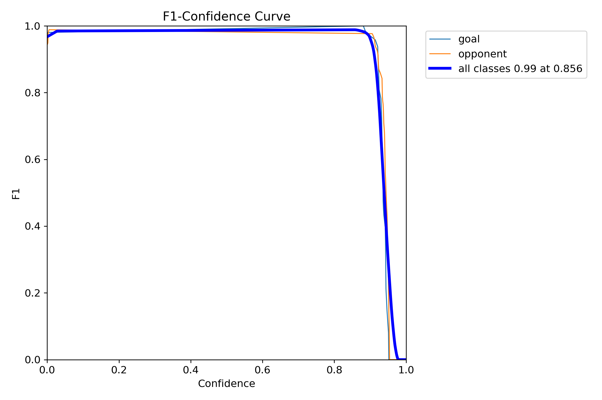
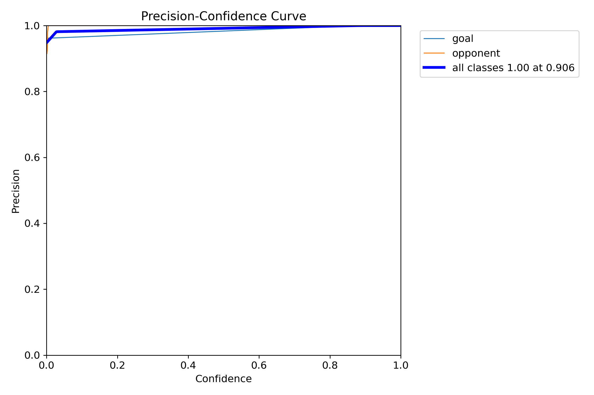
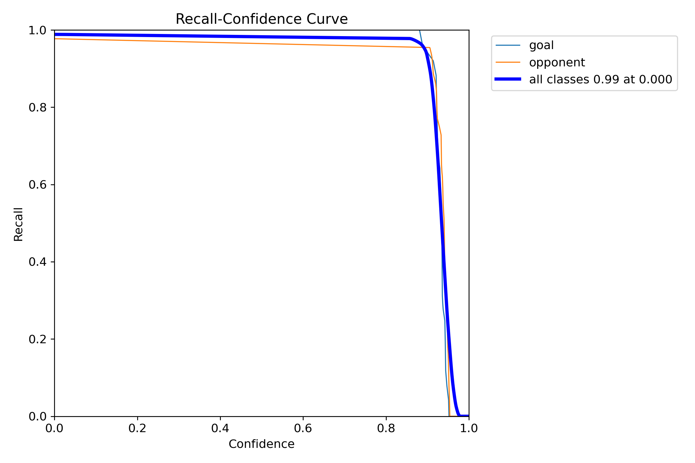
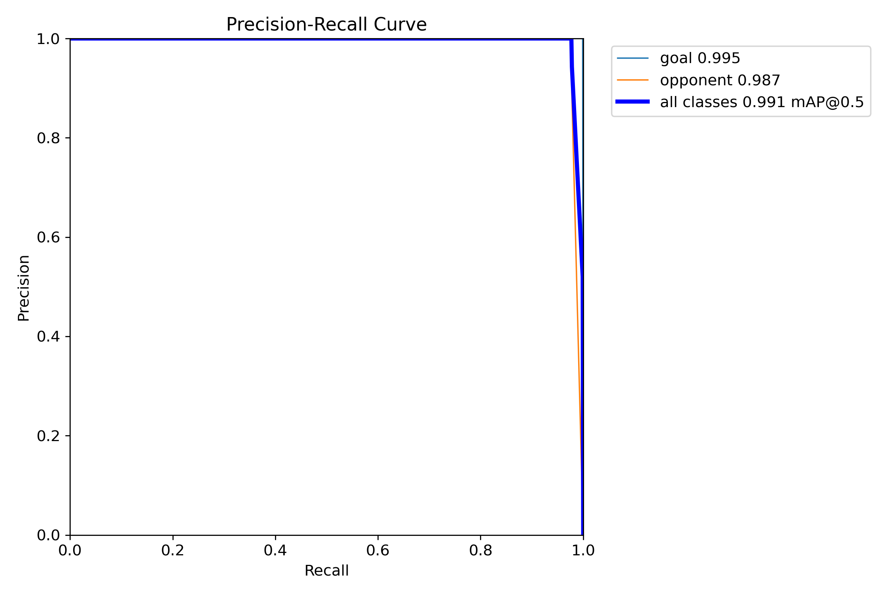
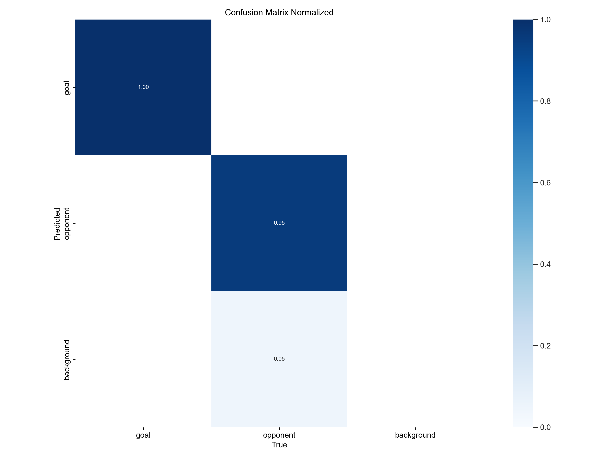
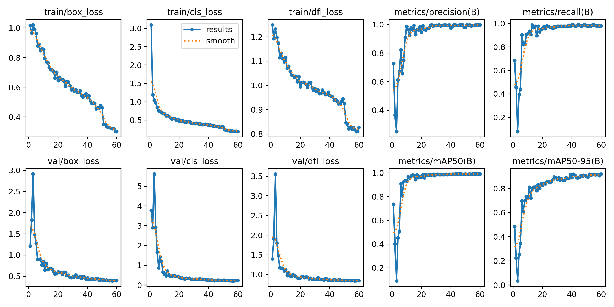
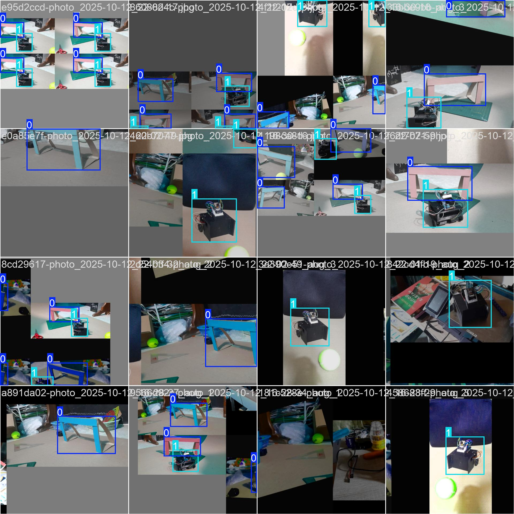
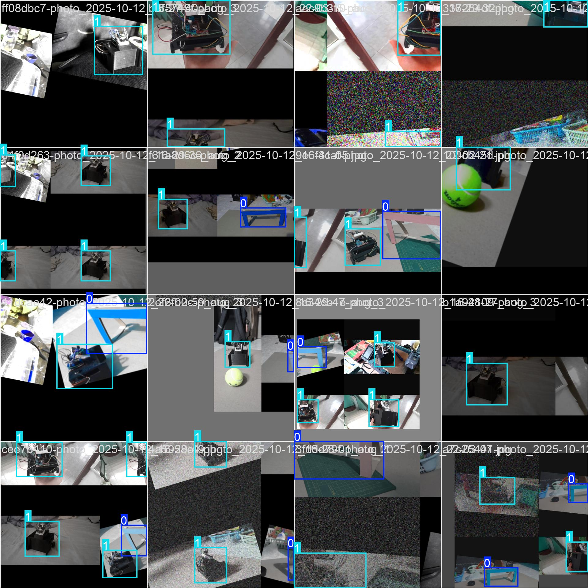
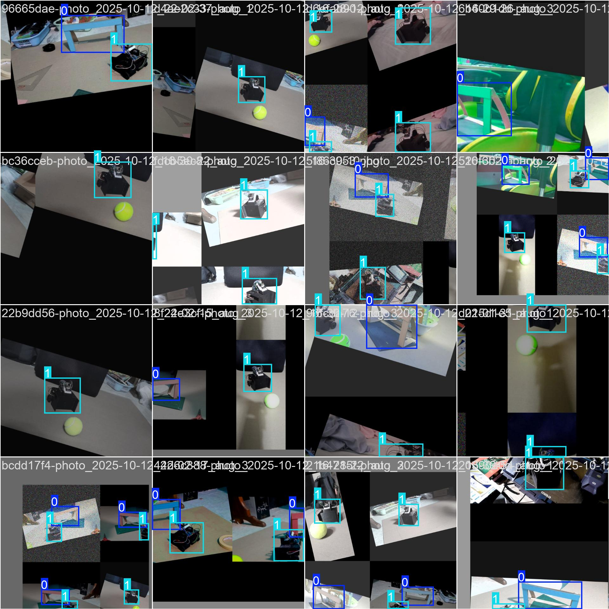
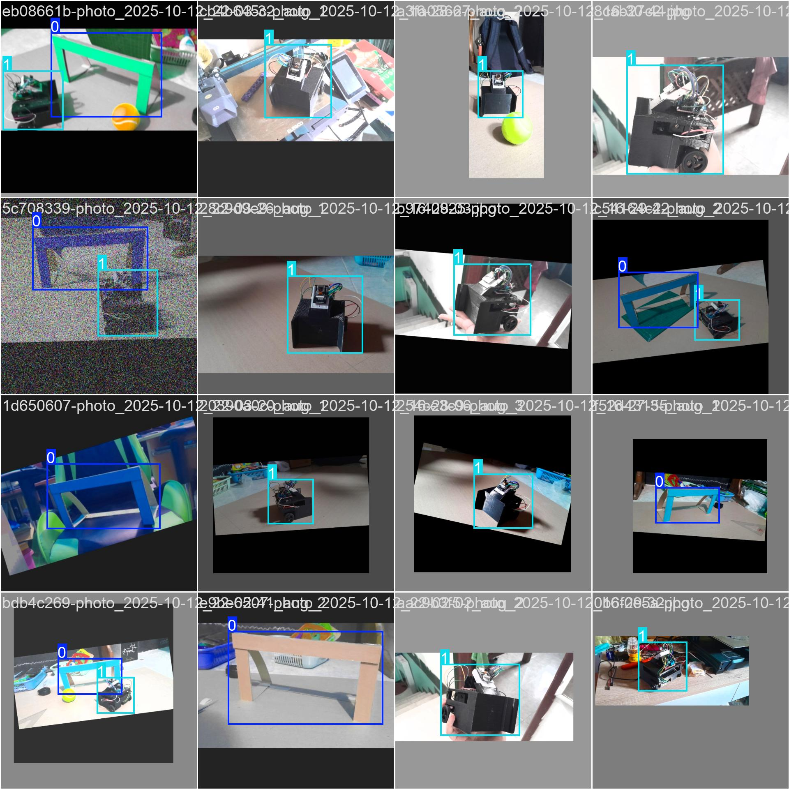

## Soccer Vision (`soccer_vision/`) — Architecture & Operation
---

### Table of contents
- [What this module does](#what-this-module-does)
- [Label Studio (annotation → YOLO export)](#label-studio-annotation--yolo-export)
- [File responsibilities (summary)](#file-responsibilities-summary)
- [Folder structure (high level)](#folder-structure-high-level)
- [Installation](#installation)
- [Results](#results)

---

### What this module does
This module provides the full **YOLOv11** workflow to detect **two classes** on the field:
- `goal`
- `opponent`

It includes robust dataset checks/splitting, a notebook & CLI to train/retrain, clearly organized artifacts (plots + best weights), and a demo notebook for batch inference on images/videos.

---

### Label Studio (annotation → YOLO export)

**Start Label Studio**
```bash
label-studio
````

Open [http://localhost:8080](http://localhost:8080) and:

1. **Create a project** (e.g., “Soccer Vision”).
2. **Labeling interface**: add **Bounding Box** tool with **two labels**:

   * `goal`
   * `opponent`
3. **Import images** and **annotate**.
4. **Export** → choose **YOLO (v5/v8/v11)** format. You’ll get:

   * `images/` (your raw images)
   * `labels/` (YOLO `.txt` files)
   * `classes.txt` (**must contain exactly** `goal` and `opponent` in the order you used)
   * (optional) `notes.json`

**Place the export under:**

````
soccer_vision/
  dataset/
    train/
      images/
      labels/
    # (optional) val/
    classes.txt   # contains: goal, opponent
````

> 💡 **Notes**
>
> * Do **not** add a “background” class to `classes.txt`.
> * If `val/` is missing, the training pipeline will create a split from `train/` (move by default; use `--copy_split` to copy).
> * Keep image–label pairs aligned (`xxx.jpg` ↔ `xxx.txt`).

---

### File responsibilities (summary)

| Path                                 | Type            | Purpose / What it does                                                                                                                                                                                                                                                                          | Key params / behaviors                                                                                                                    |
| ------------------------------------ | --------------- | ----------------------------------------------------------------------------------------------------------------------------------------------------------------------------------------------------------------------------------------------------------------------------------------------- | ----------------------------------------------------------------------------------------------------------------------------------------- |
| `notebooks/01_retrain_yolo.ipynb`    | Notebook        | Downloads `dataset.zip` (Drive), normalizes to `soccer_vision/dataset/`, validates layout, runs **live** training via `train_yolo()`, copies best weights + artifacts, writes a compact results summary cell.                                                                                   | `MODEL_BACKBONE` (defaults to `yolo11s.pt`), `EPOCHS`, `DEVICE`, etc. Always keeps artifacts inside `soccer_vision/`.                     |
| `notebooks/02_test_and_demo.ipynb`   | Notebook        | Downloads `test_data.zip` and `yolo11s.zip` (weights) from Drive, normalizes to `soccer_vision/test_data/` and `soccer_vision/models/yolo11s/`, runs inference on **images/** and **videos/**, shows a small preview grid, saves outputs to `runs/`.                                            | `CONF_THRESH`, auto-select device (GPU if available).                                                                                     |
| `notebooks/modules/train.py`         | Module          | Core trainer. Validates dataset, (optionally) creates **val split**, writes `data.yaml`, sets `ULTRALYTICS_HOME`, launches Ultralytics YOLO, then copies `best.pt` → `models/<subdir>/soccer_yolo.pt` and full **train_artifacts/**. Also runs a quick prediction pass on `dataset/val/images`. | `train_yolo()` with `model`, `epochs`, `imgsz`, `batch`, `device`, `train_pct`, `copy_split`, `out_subdir`, etc. Returns a `TrainResult`. |
| `notebooks/modules/data_utils.py`    | Module          | Helpers for data pipeline.                                                                                                                                                                                                                                                                      | `verify_dataset_or_exit`, `split_if_needed`, `write_data_yaml`, `read_classes`, `ensure_dir`.                                             |
| `notebooks/modules/paths.py`         | Module          | Robust repo root detection & common paths.                                                                                                                                                                                                                                                      | `find_repo_root()`, `base_paths()`. Honors `SOCCER_VISION_ROOT`.                                                                          |
| `notebooks/modules/logging_utils.py` | Module          | Consistent logging across notebooks/CLI.                                                                                                                                                                                                                                                        | `get_logger()`, singleton `log`.                                                                                                          |
| `notebooks/modules/cli.py`           | Module (CLI)    | Command-line entrypoint that maps args → `train_yolo()`.                                                                                                                                                                                                                                        | `python -m notebooks.modules.cli --help`                                                                                                  |
| `main.py`                            | Thin wrapper    | Re-exports the CLI (`from notebooks.modules.cli import main`).                                                                                                                                                                                                                                  | Allows `python soccer_vision/main.py ...`.                                                                                                |
| `requirements.txt`                   | Deps            | Python dependencies for training/inference.                                                                                                                                                                                                                                                     | Install Torch (CUDA build if needed) and Ultralytics.                                                                                     |
| `dataset/`                           | Data            | YOLO dataset: `train/` and (optional) `val/`.                                                                                                                                                                                                                                                   | `classes.txt` must list `goal`, `opponent`.                                                                                               |
| `models/`                            | Artifacts       | Exported weights + copied training artifacts.                                                                                                                                                                                                                                                   | e.g., `models/yolo11s/soccer_yolo.pt`, `train_artifacts/`.                                                                                |
| `runs/`                              | Artifacts       | Raw Ultralytics run folders (train and predict).                                                                                                                                                                                                                                                | Safe to prune old runs after export.                                                                                                      |
| `results/`                           | Plots (curated) | Hand-picked plots copied from train artifacts for docs.                                                                                                                                                                                                                                         | Used by the summary cell in the retrain notebook.                                                                                         |

---

### Folder structure (high level)

````
soccer_vision/
├─ dataset/
│  ├─ train/{images,labels}/
│  ├─ val/{images,labels}/
│  └─ classes.txt
├─ models/
│  └─ yolo11s/
│     ├─ soccer_yolo.pt
│     └─ train_artifacts/   # plots, curves, confusion matrices, args.yaml, ...
├─ runs/
├─ results/                  # curated copies for docs / notebook summary
├─ notebooks/
│  ├─ 01_retrain_yolo.ipynb
│  ├─ 02_test_and_demo.ipynb
│  └─ modules/
│     ├─ cli.py
│     ├─ data_utils.py
│     ├─ logging_utils.py
│     ├─ paths.py
│     └─ train.py
├─ main.py
└─ requirements.txt
````

---

### Installation

> Create the venv **inside** `soccer_vision/`, install deps, then choose one kernel method.

**1) Create & activate**

* **Windows (PowerShell)**

  ````powershell
  cd soccer_vision
  python -m venv .venv
  .\.venv\Scripts\activate
  python -m pip install --upgrade pip
  ````
* **macOS / Linux**

  ````bash
  cd soccer_vision
  python3 -m venv .venv
  source .venv/bin/activate
  python -m pip install --upgrade pip
  ````

**2) Install deps**

````bash
pip install -r requirements.txt
# GPU Torch (example CUDA 12.1)
# pip install --index-url https://download.pytorch.org/whl/cu121 torch torchvision torchaudio
# CPU-only:
# pip install --index-url https://download.pytorch.org/whl/cpu torch torchvision torchaudio
pip install -U "ultralytics>=8.3.220"
````

**3) Choose ONE kernel method**

* **A) Registered kernel**

  ````bash
  python -m ipykernel install --user --name=sv-soccer --display-name "Python (soccer_vision)"
  ````

  Then pick **Python (soccer_vision)** in Jupyter/VS Code.
* **B) Bulletproof (server from venv)**

  ````bash
  python -m pip install notebook ipykernel   # if missing
  python -m notebook
  ````

  Open `soccer_vision/notebooks/` and run the notebooks.
  *(VS Code → “Jupyter: Select Interpreter to start Jupyter server” → choose `.venv\Scripts\python.exe`.)*

**4) Quick sanity cell (in the notebook)**

````python
import sys, torch, ultralytics
print("Python:", sys.executable)
print("Torch:", torch.__version__, "| CUDA:", torch.version.cuda, "| cuda_available:", torch.cuda.is_available())
print("Ultralytics:", ultralytics.__version__)
````

---

### Results (YOLO11S — 2 classes: `goal`, `opponent`)

> Training artifacts are saved under `soccer_vision/results/`.  
> Quick takeaways: **mAP@0.5 ≈ 0.991**, **F1 peak ≈ 0.86–0.90**, very low cross-class confusion.

<table>
<tr>
  <td align="center">
    <br>
    <sub><b>F1–Confidence</b><br>
    Balance of precision/recall vs. threshold. Peak ≈ <b>0.856</b> → good default <code>conf</code>.</sub>
  </td>
  <td align="center">
    <br>
    <sub><b>Precision–Confidence</b><br>
    Precision stays ~1.0 up to ~0.90 threshold → few false positives at typical settings.</sub>
  </td>
</tr>
<tr>
  <td align="center" >
    <br>
    <sub><b>Recall–Confidence</b><br>
    High recall at low thresholds; drops after ~0.9 → explains the F1 peak.</sub>
  </td>
  <td align="center">
    <br>
    <sub><b>PR Curve</b><br>
    Per-class AP: <b>goal ≈ 0.995</b>, <b>opponent ≈ 0.987</b>, overall <b>mAP@0.5 ≈ 0.991</b>.</sub>
  </td>
</tr>
<tr>
  <td align="center" colspan="2">
    <br>
    <sub><b>Confusion Matrix (normalized)</b><br>
    Correct on diagonal. <b>goal ≈ 1.00</b>; <b>opponent ≈ 0.95</b> with ~5% missed as background.</sub>
  </td>
</tr>
<tr>
  <td align="center" colspan="2">
    <br>
    <sub><b>Training Curves Grid</b><br>
    Losses trend down; val precision/recall and mAP rise → healthy learning without divergence.</sub>
  </td>
</tr>
</table>

**Sample training batches** (augmentations + labels)  
<p align="center">
  
  <br>
  
  
  
</p>

**Interpretation & tips**

- Start inference with **`conf≈0.86–0.90`** (F1 peak), then tune for your latency/FP tolerance.  
- Confusion matrix shows **near-perfect `goal`** and **strong `opponent`** detection; a few opponents are missed at very high thresholds.  
- If you deploy on noisier footage, consider **slightly lower `conf`** (e.g., 0.7–0.8) to recover recall, or retrain with more diverse negatives.