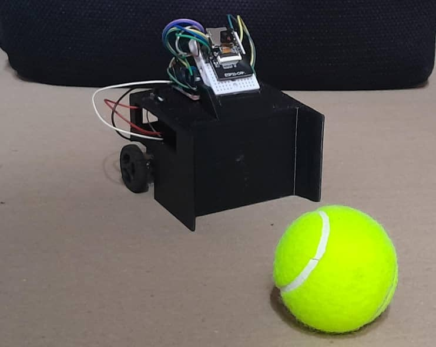

# Auto Soccer Bot — Robot Futbolista con ESP32 🤖⚽️

[English](../../README.md) · [Español](#) · [Français](../fr/README.md)

> Robot con ESP32 que juega al fútbol en **dos modos** — **manual** por gestos de la mano y **automático** con seguimiento del balón usando visión en el portátil.

  

---

## 🇪🇸 Español

### Introducción
Este proyecto es un **robot futbolista controlado por un ESP32**. Funciona en dos modos:

- **Control manual** — Una webcam en el portátil detecta **gestos de la mano**; el portátil interpreta el gesto y **envía comandos al ESP32** para mover el robot.  
- **Modo automático** — La ESP32-CAM transmite vídeo a un portátil que realiza **detección de objetos** (balón, arco/portería, oponente) y **envía comandos de movimiento** (adelante, izquierda, derecha, atrás) de vuelta al robot.

> **Estado actual:** Completamos el **seguimiento del balón** (detección + toma de decisiones) y entrenamos un **detector de oponentes**. **No** finalizamos el **detector de arcos/portería** ni la **fusión de decisiones multi-objeto** (oponente + arco).

---

## Tabla de contenidos

- 📚 **Documentación (multilenguaje)**
  - 🇬🇧 [Docs — EN](../../README.md)
  - 🇪🇸 [Docs — ES](#)
  - 🇫🇷 [Docs — FR](../fr/README.md)
- ⚙️ [**Cómo funciona**](how-it-works.md)
  - [ESP32-CAM robot — Arquitectura y Operación](esp32cam_robot.md)
  - [Control manual— Arquitectura y Operación](manual_control.md)
  - [Modo automático — Arquitectura y operación](auto_soccer_bot.md)
  - [Soccer Vision — Arquitectura y Operación](soccer_vision.md)
  - [API y Protocolos de Comunicación](api-communication-protocols.md)
- 🗂️ [**Estructura del repositorio**](repository-structure.md)
- 🔌 [**Hardware y Alimentación — Guía de Electrónica y Cableado**](hardware-power.md)
- 🧪 [**Estado del proyecto**](project_status.md)
- 🚀 [**Inicio rápido**](quick_start.md)
- 🎯 [**Conclusión, Resultados y Desafíos**](conclusion.md)
- 📄 [**License: MIT license**](../../LICENSE)

---

## Cómo funciona

  

**Figura 1.** Arquitectura y flujo de datos del Auto Soccer Bot (ESP32) en modos manual y automático.
