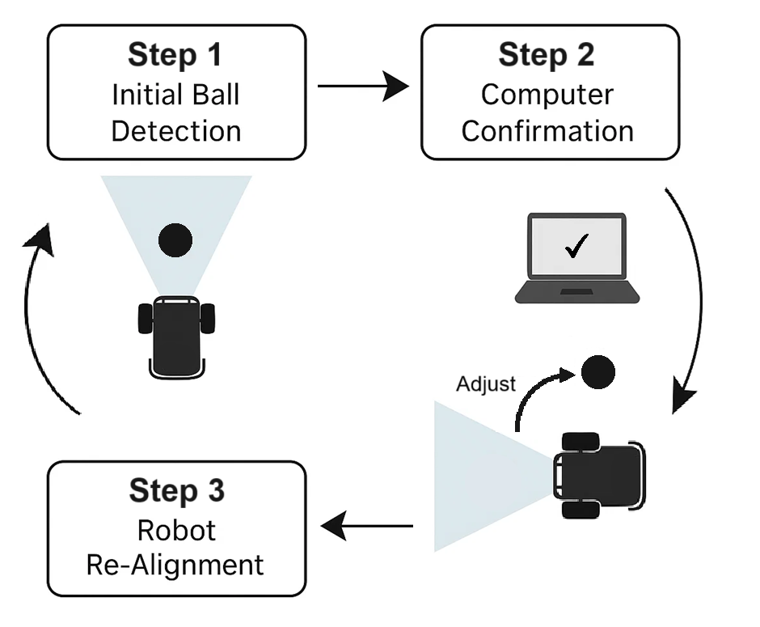

## Modo automático (`auto_soccer_bot/`) — Arquitectura y operación

### Índice
- [Qué hace este módulo](#qué-hace-este-módulo)
- [Pipeline](#pipeline)
- [Lenguajes y entorno de ejecución](#lenguajes-y-entorno-de-ejecución)
  - [Bibliotecas principales (OpenCV · HTTPX · YOLO)](#bibliotecas-principales-opencv--httpx--yolo)
- [Desafíos encontrados](#desafíos-encontrados)
- [Estructura de carpetas (alto nivel)](#estructura-de-carpetas-alto-nivel)
- [Responsabilidades de archivos (resumen)](#responsabilidades-de-archivos-resumen)
- [Instalación](#instalación)

### Qué hace este módulo
Su propósito es habilitar que el robot se gestione **de forma autónoma** para marcar goles, identificar oponentes en el campo y operar como parte de un sistema multi-robot. Cada robot es autónomo y puede detectar y seguir la pelota, llevarla a la portería y reconocer oponentes.

---
### Pipeline

1) **Ingesta del flujo (ESP32 → portátil)**
   - **Protocolo:** MJPEG sobre HTTP en **`http://<ESP32_IP>:81/stream`** (`multipart/x-mixed-replace`).
   - **Lector:** `httpx.AsyncClient.stream("GET", ESP32_STREAM_URL)` **sin tiempo de espera de lectura** y con **timeout de conexión** desde `config_auto` (ver `HTTP_TIMEOUT_CONNECT`).  
   - **Geometría del fotograma:** se conserva el tamaño nativo del flujo (**QVGA 320×240** por defecto según el firmware). En el código hay un redimensionado opcional comentado si quieres intercambiar detalle espacial por cómputo.

2) **Percepción (detección híbrida de la pelota)**
   - **¿Por qué YOLO + color?**  
     - **YOLO (basado en aprendizaje)** es robusto ante variaciones de forma/iluminación, oclusiones parciales y colores no ideales, pero es más pesado por fotograma.  
     - **Color HSV (basado en reglas)** es **muy rápido** y reacciona en cada fotograma, pero es sensible a la iluminación y a tonos del fondo.  
     - Combinarlos aporta **respuesta (color)** + **robustez (YOLO)**: programamos YOLO **cada N fotogramas** y recurrimos al color en el resto.
   - **YOLO (Ultralytics)**
     - Se ejecuta cada **`DETECTION_INTERVAL`** fotogramas (por defecto **6**).  
     - Los objetivos se filtran por `TARGET_CLASS_NAMES` (p. ej., `"sports ball"`) con el umbral `DETECTION_CONFIDENCE_THRESHOLD`.  
     - Los resultados se cachean con una **TTL** corta (`yolo_ttl_frames = max(DETECTION_INTERVAL*2, 3)`) para estabilizar entre pases.
   - **Detección por color**
     - **Umbralado HSV** con `LOWER_BALL_COLOR` / `UPPER_BALL_COLOR` para aislar el amarillo/verde de pelota de tenis.  
     - **Morfología ligera** (blur + open/close) reduce ruido; **área mínima de contorno** filtra blobs pequeños.  
     - **Aumentos opcionales de saturación/brillo** (`SATURATION`, `BRIGHTNESS`) aplicados en HSV mejoran la separabilidad cromática con iluminación pobre.
   - **Unificación**
     - Ambos detectores emiten una representación común `(center_x, center_y, area)`.  
     - **Regla de prioridad:** usar **YOLO** si su resultado en caché es **válido**; en caso contrario usar **color**; si no, **None**.

3) **Decisión (control de estados finitos)**
   - Estados: **SEARCHING → BALL_DETECTED → APPROACHING → CAPTURED**.  
   - El **corredor objetivo** impone centrado horizontal: `[TARGET_ZONE_X_MIN=0.30, TARGET_ZONE_X_MAX=0.70] * frame_width`.  
   - En `APPROACHING_BALL`, el guiado usa **giros suaves** (`turn_ratio = APPROACH_TURN_RATIO`) cuando la pelota queda a izquierda/derecha del corredor; si no, **avance**.  
   - Contadores de confirmación (`BALL_CONFIRMATION_THRESHOLD`) y **tiempos de gracia** (`MAX_ADJUSTMENT_TIMEOUT_MS`, `BALL_LOST_TIMEOUT_MS`) reducen oscilaciones y aleteo.

4) **Actuación (portátil → ESP32)**
   - `POST` JSON a **`http://<ESP32_IP>:80/move`** con payload:  
     ```json
     {"direction": "...", "speed": <0-255>, "turn_ratio": 0.0-1.0}
     ```  
   - El comunicador **deduplica** comandos repetidos y aplica **límites de frecuencia** (`MIN_TIME_BETWEEN_ANY_COMMAND_MS`, `COMMAND_SEND_INTERVAL_MS`) para no saturar el robot.

> **Tamaño/calidad de imagen:** el firmware emite JPEG **QVGA (320×240)** por defecto (`FRAMESIZE_QVGA`, `set_quality(30)` en `CameraController.h` del ESP32). 

---

### Lenguajes y entorno de ejecución
- **Lenguaje:** Python 3.10+ (probado con 3.11)
- **E/S de red:** HTTP — flujo en `http://<ESP32_IP>:81/stream`, comandos en `http://<ESP32_IP>:80/move`

#### Bibliotecas principales (OpenCV · HTTPX · YOLO)

<p align="center">
  <!-- Inserta logos si lo deseas -->
  
  
  
</p>

- **OpenCV** — decodificación JPEG, overlays de visualización, pre/post-proceso ligero.  
- **HTTPX (async)** — ingesta robusta del flujo (MJPEG troceado) y POST de comandos a `/move`.  
- **YOLO (Ultralytics)** — detección; varios pesos disponibles (YOLOv8/YOLO11). Se usa junto con el detector por color HSV para una detección de pelota resiliente.

---

### Desafíos encontrados (ampliado)

**1) Latencia de flujo → retraso en decisiones**  
- **Antes:** el uso de captura por URL con OpenCV introducía buffers internos y lecturas bloqueantes en el MJPEG, provocando reacciones “por detrás” del vídeo (cola acumulada).  
- **Soluciones:**  
  - Cambio a **HTTPX** con parseo explícito de límites y **conservación solo del último fotograma** (descartar antiguos).  
  - Mantener firmware en **QVGA** con calidad JPEG moderada para reducir coste red+decode.  
  - Acelerar percepción pesada ejecutando **YOLO y color cada `DETECTION_INTERVAL` fotogramas** para evitar pilas de imágenes pendientes.  
- **Resultado:** control **más ágil**, menos ráfagas de frames obsoletos y movimiento más suave durante el seguimiento.

**2) Estabilidad del flujo (timeouts, backpressure, Wi-Fi)**
- **Antes:** el bucle de captura podía bloquearse o acumular datos sin leer con jitter de Wi-Fi.  
- **Soluciones:**  
  - Streaming **HTTPX** en una tarea async dedicada con **timeout de conexión** y **sin timeout de lectura** para streams largos.  
  - Parseo robusto de cabeceras (`Content-Length`) con resincronización en partes mal formadas y recorte acotado del buffer.  
- **Resultado:** **más resiliencia** a caídas intermitentes y recuperación rápida sin reiniciar la app.

**3) Robustez vs. velocidad en percepción**  
- **Antes:** YOLO en cada fotograma era costoso; solo color era frágil ante iluminación/fondo.  
- **Soluciones:**  
  - **Detector híbrido:** YOLO programado + **HSV color cada fotograma**; boosts **HSV** (`SATURATION=3.5`, `BRIGHTNESS=1`), morfología y filtro por **área mínima**.  
  - Salida unificada `(cx, cy, area)` para que el controlador sea agnóstico a la fuente.  
- **Resultado:** **detecciones estables** con **menor cómputo**, manteniendo respuesta y tolerando mejor variaciones de entorno.

**4) Alineación y oscilaciones**  
- **Antes:** un pivot izquierda/derecha directo sobre el error x instantáneo causaba jitter y cambios de estado al cruzar el centro.  
- **Soluciones:**  
  - **Autómata de estados** con **contadores de confirmación** (`BALL_CONFIRMATION_THRESHOLD`) y **tiempos de gracia** (`MAX_ADJUSTMENT_TIMEOUT_MS`, `BALL_LOST_TIMEOUT_MS`).  
  - **Corredor objetivo** `[TARGET_ZONE_X_MIN, TARGET_ZONE_X_MAX]` y **giros suaves** con `APPROACH_TURN_RATIO`.  
- **Resultado:** **menos oscilación**, transiciones más deliberadas y aproximación más estable.

<p align="center">
  
</p>

**5) Saturación de comandos en el ESP32**  
- **Antes:** comandos idénticos repetidos consumían ancho de banda y CPU del microcontrolador.  
- **Soluciones:**  
  - **Deduplicación + rate limiting** en `RobotCommunicator` con `MIN_TIME_BETWEEN_ANY_COMMAND_MS` y `COMMAND_SEND_INTERVAL_MS`; seguimiento de `{direction, speed, turn_ratio}` enviados.  
- **Resultado:** **menos ruido** en el plano de control y temporización de actuación más predecible.

**6) Portabilidad de modelos/artefactos**  
- **Consideración:** los pesos de YOLO son grandes y pueden variar entre hosts.  
- **Práctica:** mantener varios pesos en `models/` (p. ej., `yolov11s.pt` para CPU) y seleccionarlos vía `config_auto.YOLO_MODEL_PATH`. Usar Git LFS o un almacén de artefactos cuando sea necesario.

---

### Estructura de carpetas (alto nivel)
````
auto_soccer_bot/
├─ application.py              # Orquesta el bucle async: ingesta → detección → decisión → mando → visualización
├─ ball_detector.py            # Detector híbrido: YOLO (Ultralytics) + fallback HSV
├─ camera_manager.py           # Lector MJPEG por HTTPX (puerto 81 /stream) + webcam opcional
├─ config_auto.py              # IP/puertos, URL de stream, umbrales, HSV, ganancias del controlador
├─ detection_manager_base.py   # Interfaz abstracta de detectores
├─ robot_controller.py         # FSM para seguimiento y alineación de la pelota
├─ robot_communicator.py       # Cliente HTTP async que publica JSON a /move (puerto 80)
├─ main.py                     # Punto de entrada (`python -m auto_soccer_bot.main`)
├─ requirements.txt            # Deps: httpx, opencv-python, ultralytics, numpy, …
└─ models/
  ├─ yolo11l.pt
  ├─ yolo11m.pt
  ├─ yolo11n.pt
  ├─ yolo11s.pt
  └─ yolov8n.pt

````

---

### Responsabilidades de archivos (resumen)

| Ruta | Tipo | Propósito principal | Elementos/Endpoints clave | Notas |
|---|---|---|---|---|
| `application.py` | Orquestador | Inicia componentes; ejecuta el bucle async; overlays de depuración | Flujo: **`CameraManager.get_frame()` → `BallDetector.process_frame()` → `RobotController.decide_action()` → `RobotCommunicator.send_command()`** | Realce de color con `enhance_frame_colors()` al hacer streaming; detección programada con `DETECTION_INTERVAL`. |
| `ball_detector.py` | Percepción | **Detección híbrida**: YOLO cada N + **HSV** cada frame | Pesos YOLO de `config.YOLO_MODEL_PATH`; objetivos `TARGET_CLASS_NAMES`; HSV `LOWER_BALL_COLOR`/`UPPER_BALL_COLOR` | Salida unificada `(cx, cy, area)`; dibuja bbox/círculo; CPU/GPU auto; caché TTL de YOLO. |
| `camera_manager.py` | Ingesta de flujo | Lector **HTTPX** MJPEG del ESP32 | **Stream:** `config.ESP32_STREAM_URL` → **`http://<ESP32_IP>:81/stream`**; boundary `--123456789000000000000987654321` | Conserva solo el **último** frame para reducir latencia; resize opcional comentado; soporta webcam. |
| `robot_controller.py` | Decisión | FSM: **SEARCHING → BALL_DETECTED → APPROACHING → CAPTURED** | Corredor `[TARGET_ZONE_X_MIN, TARGET_ZONE_X_MAX]`; velocidades `SEARCH_TURN_SPEED`, `APPROACH_SPEED`, `DRIBBLE_SPEED`; `APPROACH_TURN_RATIO` | Ventanas de confirmación y tiempos de gracia (`BALL_CONFIRMATION_THRESHOLD`, `MAX_ADJUSTMENT_TIMEOUT_MS`). |
| `robot_communicator.py` | Transporte | Envía JSON; deduplica y limita frecuencia | **Control:** `config.ESP32_MOVE_ENDPOINT` → **`http://<ESP32_IP>:80/move`**; payload `{"direction","speed","turn_ratio"}` | Guardas de tasa: `MIN_TIME_BETWEEN_ANY_COMMAND_MS`, `COMMAND_SEND_INTERVAL_MS`. |
| `config_auto.py` | Config | Parámetros de ejecución | Fuente `VIDEO_SOURCE` (`esp32_httpx`/`webcam`), boosts HSV, ruta YOLO, ganancias/umbrales | Por defecto: **QVGA**, `SATURATION=3.5`, `BRIGHTNESS=1`, `DETECTION_INTERVAL=6`. |
| `detection_manager_base.py` | Abstracción | Interfaz de detectores | `initialize()`, `process_frame()`, `get_detection_data()` | Permite futuros detectores (portería/oponente). |
| `main.py` | Entrada | Lanza con `asyncio.run(start_auto_application())` | — | Los comentarios mencionan **`venv_auto_soccer`**; mantener coherencia. |
| `requirements.txt` | Deps | Paquetes de ejecución | `httpx`, `opencv-python`, `ultralytics`, `numpy`, … | Con GPU, asegurar CUDA/cuDNN compatibles. |
| `models/*.pt` | Artefactos | Pesos YOLO | yolo11*, yolov8n | Modelos ligeros recomendados en CPU. |

---

### Instalación

**Requisitos previos**
- Python **3.10+** (recomendado 3.11)
- ESP32 accesible en tu red y emitiendo en `http://<ESP32_IP>:81/stream`

**1) Crear y activar el entorno (`venv_auto_soccer`)**

> Ejecuta desde la **raíz** del repositorio (padre de `auto_soccer_bot/`).

**Linux/macOS**
```bash
python3 -m venv auto_soccer_bot/venv_auto_soccer
source auto_soccer_bot/venv_auto_soccer/bin/activate
```

**Windows (PowerShell)**
```powershell
py -3 -m venv auto_soccer_bot\venv_auto_soccer
.\auto_soccer_bot\venv_auto_soccer\Scripts\Activate.ps1
```

**2) Instalar dependencias**
```bash
pip install -r auto_soccer_bot/requirements.txt
```

**3) Configurar**
- Edita `auto_soccer_bot/config_auto.py`:
  - Define `ESP32_IP_ADDRESS = "..."` y ajusta puertos si es necesario.
  - Selecciona pesos YOLO bajo `models/` y umbrales.
  - Ajusta ganancias del controlador, corredor objetivo y (opcionalmente) resize en ingesta.

**4) Ejecutar (desde la raíz)**
````bash
python -m auto_soccer_bot.main
````
- Una ventana de depuración (opcional) mostrará detecciones y guiado.
- Los logs mostrarán tiempos de frame, comando elegido y respuestas HTTP.