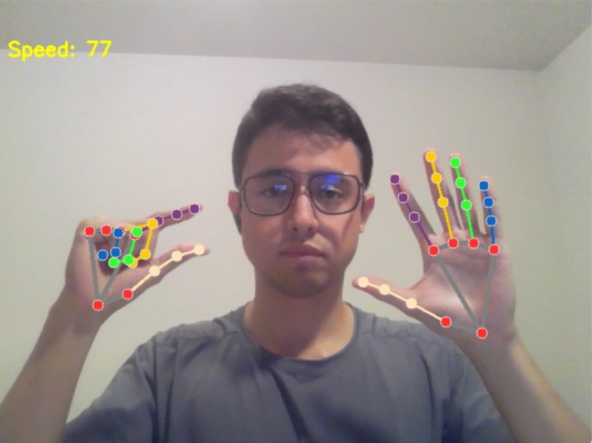
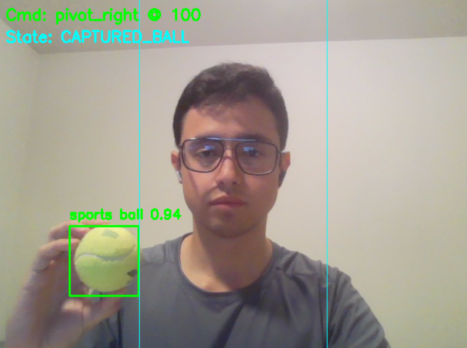
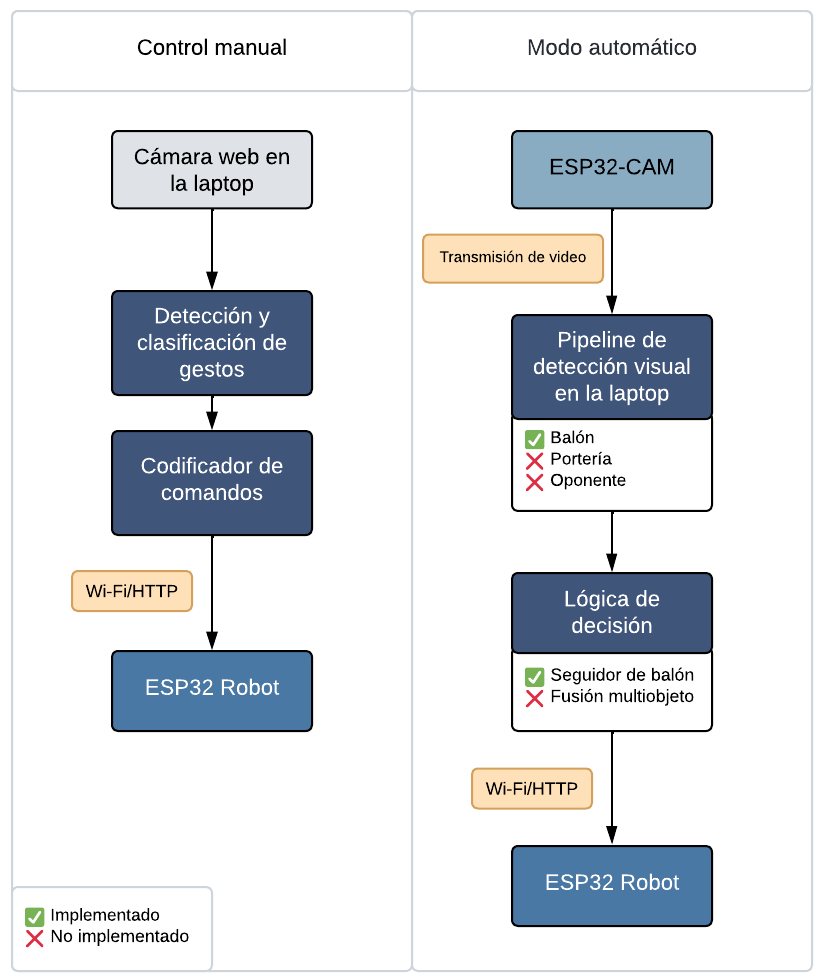

## Cómo funciona

Esta sección describe el flujo de datos y los bucles de control para **Control manual** y **Modo automático**, tal como se resume en la **Figura 1**. El sistema sigue un ciclo **sensar → interpretar → ordenar → actuar**, donde el **portátil** ejecuta percepción y toma de decisiones, y el **ESP32** resuelve la actuación de bajo nivel.
---

### 1) Control manual (teleoperación por gestos)

**Objetivo.** Permitir que el usuario dirija el robot mediante gestos de la mano capturados por la webcam del portátil.

**Pipeline.**
1. **Sensado — Webcam en el portátil.** Se capturan frames RGB a la resolución nativa y se entregan al proceso local.
2. **Percepción — Detección y clasificación de gestos.** Cada frame se preprocesa y pasa por el pipeline de gestos para inferir una clase de comando (*adelante*, *izquierda*, *derecha*, *atrás*, *stop*).
3. **Decisión/Codificación — *Command encoder*.** El gesto discreto se mapea a primitivas de movimiento (lineal/angulares) y se codifica como solicitudes HTTP.
4. **Actuación — Robot con ESP32.** Los comandos se envían por **Wi-Fi/HTTP**; el ESP32 parsea la carga útil y actualiza los PWM de los motores.

**Notas.**
- Este lazo está **totalmente implementado** y funciona en tiempo real en portátiles de uso común.
- La comunicación es *stateless* (petición/respuesta). El *rate-limiting* y el *debounce* de comandos se gestionan en el portátil.

  

**Figura 2.** Salida del pipeline de gestos mostrando *keypoints* de la mano para la teleoperación.

---

### 2) Modo automático (autonomía con visión en el bucle)

**Objetivo.** Cerrar el lazo percepción-control usando visión en el portátil alimentada por el *stream* de la ESP32-CAM.

**Pipeline.**
1. **Sensado — ESP32-CAM (transmisión de vídeo).** La cámara expone un *stream* MJPEG (o equivalente) por Wi-Fi.
2. **Percepción — Pipeline de detección en el portátil.** El portátil consume el *stream* y ejecuta detección para localizar:
   - **Balón** — ✓ implementado (detector operativo).
   - **Arco/portería** — ✗ no implementado.
   - **Oponente** — ✗ modelo entrenado pero **no integrado** en el *pipeline* en vivo.
3. **Decisión — Lógica de control.**
   - **Seguidor de balón** — ✓ implementado (gira/avanza según la pose del balón en imagen).
   - **Fusión multiobjeto** (balón + arco + oponente) — ✗ no implementado.
4. **Actuación — Robot con ESP32.** El movimiento elegido se codifica como comandos HTTP y se envía al ESP32, que actualiza las salidas de motor.

**Notas.**
- El nivel actual de autonomía es **seguimiento de un único objetivo** (balón). Sin fusión con arco/oponente no hay aún alineación de tiro ni evitación de colisiones.
- La arquitectura desacopla **percepción** y **actuación**, facilitando futuras mejoras (p. ej., modelos cuantizados) sin cambiar el firmware.

  

**Figura 3.** Ejemplo del detector de balón y estado del controlador durante la operación automática (la línea vertical marca el centro de imagen; ‘Cmd’ muestra la orden emitida).

---

### Responsabilidades por componente (resumen)

| Capa           | Componente                | Responsabilidad                                              | Estado                 |
|----------------|---------------------------|--------------------------------------------------------------|------------------------|
| Sensado        | ESP32-CAM / Webcam        | Captura de vídeo                                             | ✓                      |
| Percepción     | Pipeline en portátil      | Detectar balón (✓), arco (✗), oponente (✗ integración)      | Parcial                |
| Decisión       | Controlador en portátil   | Seguidor de balón (✓); fusión multiobjeto (✗)               | Parcial                |
| Comunicación   | Wi-Fi/HTTP                | Transporte de comandos (portátil → ESP32)                    | ✓                      |
| Actuación      | Firmware del ESP32        | Parseo de comandos; control PWM de motores                   | ✓                      |

**Leyenda:** ✓ Completado ✗ No implementado

---

  

**Figura 1.** Arquitectura y flujo de datos del Auto Soccer Bot (ESP32) en modos manual y automático.
