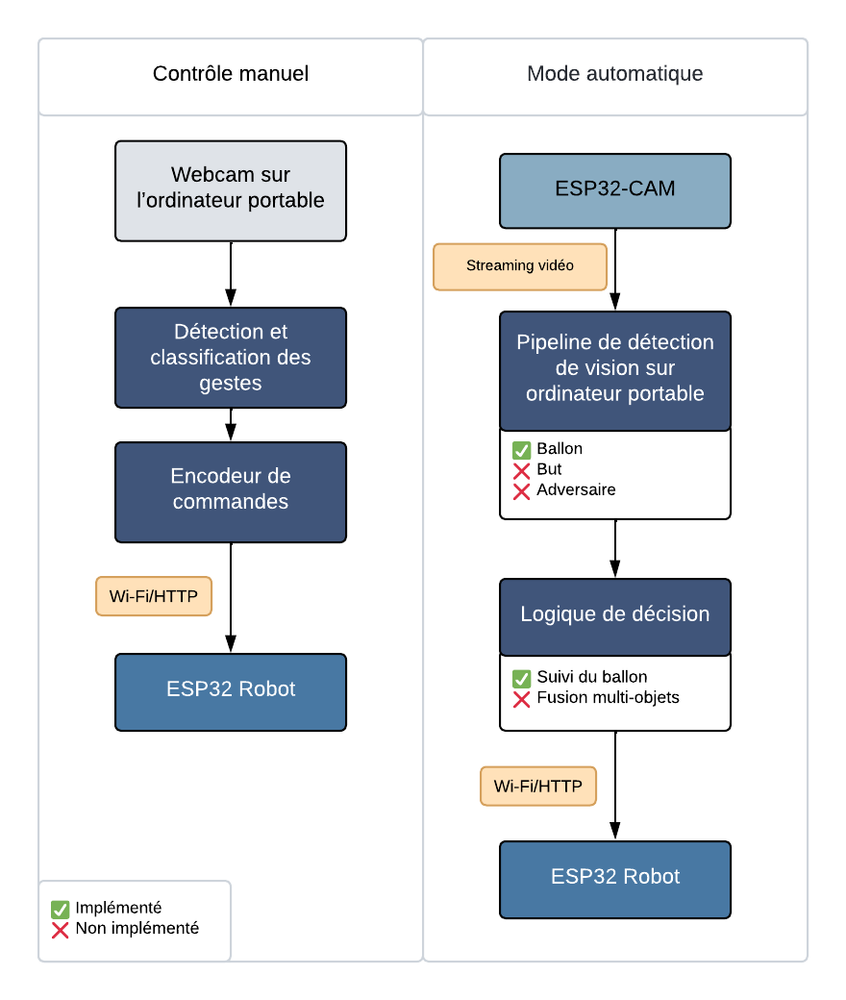

# Auto Soccer Bot — Robot Foot à base d’ESP32 🤖⚽️

[English](../../README.md) · [Español](../es/README.md) · [Français](#)

> Robot à base d’ESP32 qui joue au football en **deux modes** — **manuel** via gestes de la main et **automatique** avec suivi du ballon grâce à la vision sur l’ordinateur.

  

---

## 🇫🇷 Français

### Introduction
Ce projet est un **robot foot contrôlé par un ESP32**. Il fonctionne en deux modes :

- **Contrôle manuel** — Une webcam sur l’ordinateur détecte les **gestes de la main** ; l’ordinateur interprète le geste et **envoie des commandes à l’ESP32** pour piloter le robot.  
- **Mode automatique** — L’ESP32-CAM diffuse la vidéo vers un ordinateur qui effectue la **détection d’objets** (ballon, but, adversaire) et **renvoie des commandes de mouvement** (avant, gauche, droite, arrière) au robot.

> **Statut actuel :** Nous avons achevé le **suivi du ballon** (détection + prise de décision) et entraîné un **détecteur d’adversaires**. Nous **n’avons pas** finalisé le **détecteur de but** ni la **fusion décisionnelle multi-objets** (adversaire + but).

---

## Table des matières

- 📚 **Documentation (multilingue)**
  - 🇬🇧 [Docs — EN](../../README.md)
  - 🇪🇸 [Docs — ES](../es/README.md)
  - 🇫🇷 [Docs — FR](#)
- ⚙️ [**Fonctionnement**](how-it-works.md)
  - [ESP32-CAM robot — Architecture & Fonctionnement](esp32cam_robot.md)
  - [Contrôle manuel — Architecture & Fonctionnement](manual_control.md)
  - [Mode automatique — Architecture et fonctionnement](auto_soccer_bot.md)
  - [Soccer Vision — Architecture et fonctionnement](soccer_vision.md)
  - [API et Protocoles de Communication](api-communication-protocols.md)
- 🗂️ [**Structure du dépôt**](repository-structure.md)
- 🔌 [**Matériel & Alimentation — Guide d’électronique et de câblage**](hardware-power.md)
- 🧪 [**Statut du projet**](project_status.md)
- 🚀 [**Démarrage rapide**](quick_start.md)
- 🎯 [**Conclusion, Résultats & Défis**](conclusion.md)
- 📄 [**License: MIT license**](../../LICENSE)

---

## Fonctionnement

  

**Figure 1.** Architecture et flux de données de l’Auto Soccer Bot (ESP32) en modes manuel et automatique.
