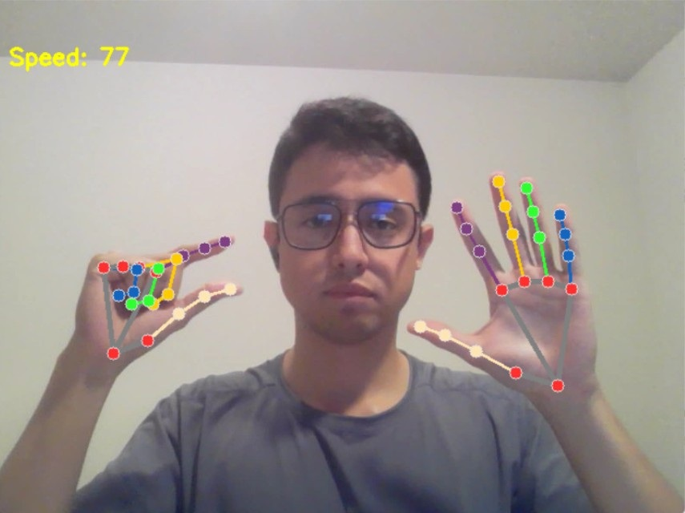
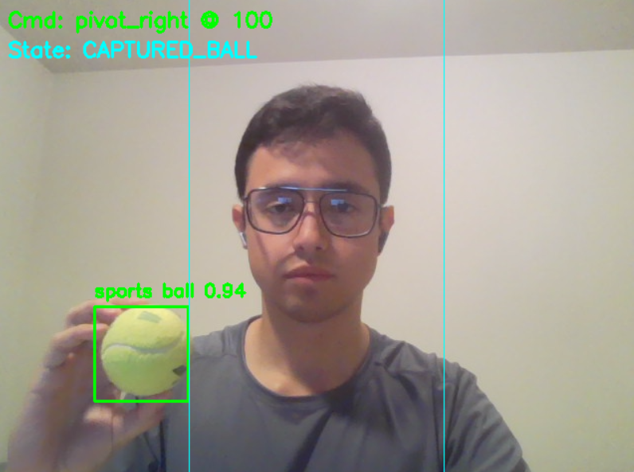
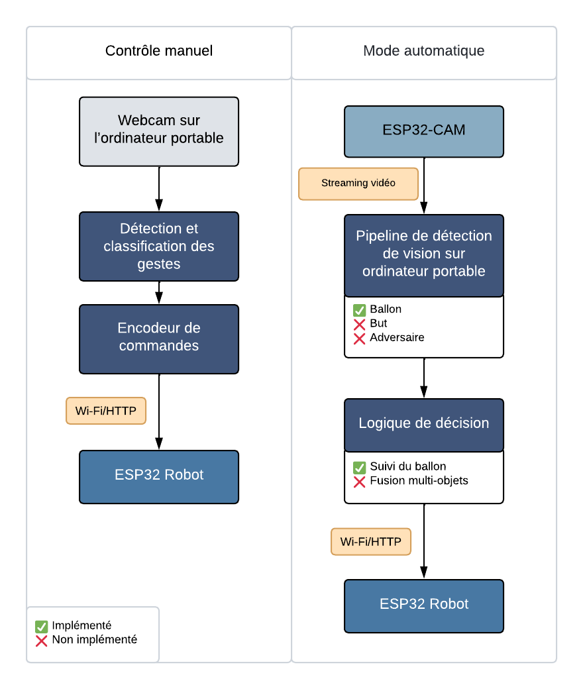

## Fonctionnement

Cette section décrit le flux de données et les boucles de contrôle pour le **Contrôle manuel** et le **Mode automatique**, résumés dans la **Figure 1**. L’architecture suit le cycle **percevoir → interpréter → commander → agir**, où l’**ordinateur portable** assure la perception et la décision, et l’**ESP32** exécute l’actionnement bas niveau.

---

### 1) Contrôle manuel (téléopération par gestes)

**Objectif.** Permettre à l’utilisateur de piloter le robot via des gestes de la main captés par la webcam du portable.

**Pipeline.**
1. **Acquisition — Webcam du portable.** Des images RGB sont capturées à la résolution native et transmises au processus local.
2. **Perception — Détection et classification de gestes.** Chaque image est prétraitée puis passée dans le pipeline de gestes pour inférer une classe de commande (*avant*, *gauche*, *droite*, *arrière*, *stop*).
3. **Décision/Codage — *Command encoder*.** Le geste discret est mappé en primitives de mouvement (consignes linéaires/angularies) et encodé en requêtes HTTP.
4. **Actionnement — Robot à base d’ESP32.** Les commandes sont envoyées via **Wi-Fi/HTTP** ; l’ESP32 analyse la charge utile et met à jour les PWM des moteurs.

**Notes.**
- Cette boucle est **entièrement implémentée** et fonctionne en temps réel sur des portables standard.
- La communication est *stateless* (requête/réponse). La limitation de débit et l’anti-rebond logiciel sont gérés côté portable.

  

**Figure 2.** Sortie du pipeline de gestes avec *keypoints* de la main utilisés pour la téléopération.

---

### 2) Mode automatique (vision dans la boucle)

**Objectif.** Fermer la boucle perception-commande grâce à une pile de vision sur le portable, alimentée par le flux de l’ESP32-CAM.

**Pipeline.**
1. **Acquisition — ESP32-CAM (diffusion vidéo).** La caméra expose un flux MJPEG (ou équivalent) via Wi-Fi.
2. **Perception — Pipeline de détection sur le portable.** Le portable consomme le flux et exécute la détection pour localiser :
   - **Ballon** — ✓ implémenté (détecteur opérationnel).
   - **But** — ✗ non implémenté.
   - **Adversaire** — ✗ modèle entraîné mais **non intégré** au pipeline temps réel.
3. **Décision — Logique de contrôle.**
   - **Suivi du ballon** — ✓ implémenté (tourner/avancer selon la position du ballon dans l’image).
   - **Fusion multi-objets** (ballon + but + adversaire) — ✗ non implémentée.
4. **Actionnement — Robot à base d’ESP32.** Le mouvement choisi est encodé en commandes HTTP et transmis à l’ESP32, qui met à jour les sorties moteur.

**Notes.**
- Le niveau d’autonomie actuel est le **suivi d’une seule cible** (ballon). Sans fusion but/adversaire, l’alignement de tir et l’évitement de collision ne sont pas encore disponibles.
- La conception sépare **perception** et **actionnement**, facilitant les évolutions ultérieures (p. ex. modèles quantifiés) sans modifier le firmware.

  

**Figure 3.** Exemple du détecteur de ballon et de l’état du contrôleur durant l’opération automatique (la ligne verticale marque le centre de l’image ; ‘Cmd’ affiche la commande émise).

---

### Responsabilités par composant (vue d’ensemble)

| Couche         | Composant                 | Responsabilité                                               | Statut                 |
|----------------|---------------------------|--------------------------------------------------------------|------------------------|
| Acquisition    | ESP32-CAM / Webcam        | Capture vidéo                                                | ✓                      |
| Perception     | Pipeline sur portable     | Détecter ballon (✓), but (✗), adversaire (✗ intégration)    | Partiel                |
| Décision       | Contrôleur sur portable   | Suivi du ballon (✓) ; fusion multi-objets (✗)               | Partiel                |
| Communication  | Wi-Fi/HTTP                | Transport des commandes (portable → ESP32)                   | ✓                      |
| Actionnement   | Firmware ESP32            | Analyse des commandes ; contrôle PWM des moteurs             | ✓                      |

**Légende :** ✓ Terminé ✗ Non implémenté

---

  

**Figure 1.** Architecture et flux de données de l’Auto Soccer Bot (ESP32) en modes manuel et automatique.