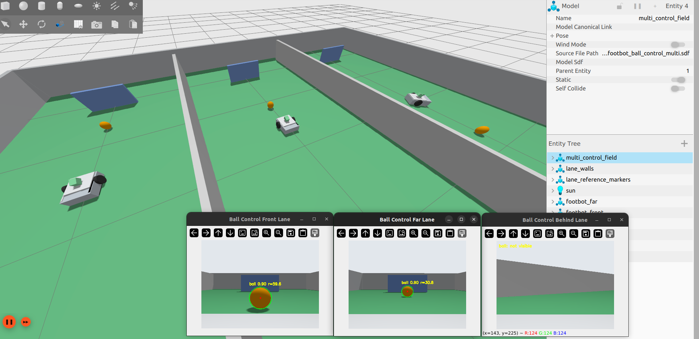

# Control de pelota

El control de pelota es el único comportamiento de fútbol autónomo implementado
actualmente. Usa percepción determinista, estimación de estado, skills y una FSM.

<p align="center">
  
</p>

**Figura 1.** Control de pelota ejecutándose en Gazebo con el visor de imágenes de
depuración mostrando la pelota naranja detectada y el feedback de estado.

## Lanzamiento

Primero compila y haz source:

```bash
cd /media/josedanielchg/Data/Proyectos/Robotica/footbot/simulation/ros2_ws
source /opt/ros/humble/setup.bash
colcon build --symlink-install
source install/setup.bash
```

Ejecuta el comportamiento de control de pelota de un solo escenario:

```bash
ros2 launch footbot_bringup ball_control.launch.py scenario:=front show_debug_view:=true
```

Escenarios:

```text
front
left
right
far
close
misaligned
```

## Prueba multi-carril

El lanzamiento multi-carril inicia tres escenarios separados por paredes en un
mismo mundo de Gazebo:

```text
front   la pelota empieza frente al robot
far     la pelota empieza más lejos
behind  la pelota empieza detrás del robot, así que el robot debe rotar para buscar
```

Lanzar sin ventanas de depuración:

```bash
ros2 launch footbot_bringup ball_control_multi.launch.py
```

Lanzar con ventanas de imagen de depuración:

```bash
ros2 launch footbot_bringup ball_control_multi.launch.py show_debug_view:=true
```

En otra terminal, haz source del workspace:

```bash
source /opt/ros/humble/setup.bash
source /media/josedanielchg/Data/Proyectos/Robotica/footbot/simulation/ros2_ws/install/setup.bash
```

Lista los topics específicos de cada carril:

```bash
ros2 topic list | grep ball_control
```

Inspecciona el estado de la FSM de cada carril:

```bash
ros2 topic echo /ball_control/front/soccer/fsm_state
ros2 topic echo /ball_control/far/soccer/fsm_state
ros2 topic echo /ball_control/behind/soccer/fsm_state
```

Inspecciona el estado estimado de la pelota:

```bash
ros2 topic echo /ball_control/front/soccer/ball_state
ros2 topic echo /ball_control/far/soccer/ball_state
ros2 topic echo /ball_control/behind/soccer/ball_state
```

Inspecciona los comandos de velocidad:

```bash
ros2 topic echo /ball_control/front/cmd_vel
ros2 topic echo /ball_control/far/cmd_vel
ros2 topic echo /ball_control/behind/cmd_vel
```

Comportamiento esperado:

- `front`: detecta la pelota rápidamente y se aproxima a ella.
- `far`: se aproxima más despacio porque la pelota empieza más lejos.
- `behind`: rota para buscar antes de poder alinearse con la pelota.
- Cada carril usa topics aislados bajo `/ball_control/<lane>/`.

## Topics

```text
/camera/image_raw
/ball_detection
/ball/debug_image
/soccer/ball_state
/soccer/fsm_state
/cmd_vel
```

## Nodos

| Nodo | Paquete | Propósito |
| --- | --- | --- |
| `ball_detector` | `footbot_perception` | Detección HSV de la pelota naranja desde la cámara del robot. |
| `ball_state_estimator` | `footbot_soccer_behavior` | Convierte `Detection2D` en `BallState`. |
| `ball_control_fsm` | `footbot_soccer_behavior` | Elige skills y publica `/cmd_vel`. |

## Estados de la FSM

```text
SEARCH_BALL
ALIGN_TO_BALL
APPROACH_BALL
CONTACT_BALL
CONTROL_BALL
ROTATE_WITH_BALL
RECOVER_BALL
STOP_SAFE
```

La FSM es dueña de las transiciones. Las skills solo producen comandos `Twist`
acotados para el estado actual.

## Valores por defecto compartidos

Los parámetros por defecto están documentados en:

```text
simulation/ros2_ws/src/footbot_soccer_behavior/config/ball_control.yaml
```

El estimador usa el radio aparente de la pelota y el FOV de la cámara para estimar
un rango aproximado. Esto es apropiado para simulación, pero no es un estimador de
pose 3D calibrado.

## Límites actuales

Este comportamiento no dispara, no marca goles, no roba a oponentes, no coordina
un equipo ni usa aprendizaje por refuerzo.
