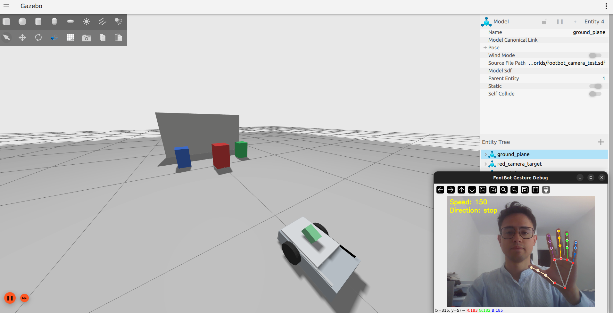

# Percepción y datasets

<p align="center">
  
</p>

**Figura 1.** Vista de depuración del control por gestos nativo de ROS con los
landmarks de mano de MediaPipe, la dirección y el feedback de velocidad.

## Topics de cámara

Cámara simulada del robot por defecto:

```text
/camera/image_raw
/camera/camera_info
```

Cámara de portero del campo de fútbol:

```text
/soccer/camera/image_raw
/soccer/camera/camera_info
```

## Detección HSV de la pelota

`footbot_perception` proporciona `ball_detector`, que publica:

```text
/ball_detection
/ball/debug_image
```

Este detector es determinista y está ajustado para la pelota naranja simulada.

## Visión de fútbol con YOLO

`footbot_soccer_vision` proporciona:

```text
opponent_detector
goal_detector
image_capture
```

Salidas por defecto:

```text
/opponent_detections
/opponent_detection/debug_image
/goal_detections
/goal_detection/debug_image
```

Las detecciones usan `vision_msgs/msg/Detection2DArray`.

Las detecciones de pelota/portería de reach-goal usan:

```text
/soccer/detections
/soccer/detections/debug_image
```

Ejecuta la escena de visión de Reach-goal de un robot:

```bash
ros2 launch footbot_bringup reach_goal.launch.py \
  model_path:=/media/josedanielchg/Data/Proyectos/Robotica/footbot/simulation/ros2_ws/src/footbot_soccer_vision/models/reach_goal_ball_goal/reach_goal_ball_goal_v1_best.pt \
  target_classes:=ball,goal \
  show_debug_view:=true
```

Si usas `soccer_field.launch.py` directamente, pasa
`image_topic:=/soccer/camera/image_raw` al detector YOLO; de lo contrario, la
ventana de imagen de depuración quedará en negro porque el detector estará
escuchando el topic de cámara equivocado.

Instala las dependencias opcionales de YOLO:

```bash
python3 -m pip install --user -r simulation/requirements-yolo.txt
```

Los pesos del modelo están ignorados por Git. Coloca los pesos locales en:

```text
simulation/ros2_ws/src/footbot_soccer_vision/models/weights/
```

## Captura de datasets

```bash
ros2 run footbot_soccer_vision image_capture \
  --ros-args -p image_topic:=/camera/image_raw
```

Las imágenes y etiquetas generadas están ignoradas por Git.

<p align="center">
  
</p>

**Figura 2.** Vista del proyecto en Label Studio con objetos de fútbol etiquetados
para entrenamiento YOLO, incluyendo cajas de `ball`, `goal` y `opponent`.

## Aumento conservador

Para 40 originales, crea 40 originales copiados más 120 imágenes
rotadas/oscurecidas:

```bash
python3 simulation/ros2_ws/src/footbot_soccer_vision/datasets/augment_dataset.py \
  --input-dir simulation/ros2_ws/src/footbot_soccer_vision/datasets/raw/soccer_v1/images \
  --output-dir simulation/ros2_ws/src/footbot_soccer_vision/datasets/raw/soccer_v1/augmented_images \
  --output-size 640 640 \
  --rotation-angles 90 180 270 \
  --brightness-factor 0.85 \
  --copy-originals \
  --clean-output
```

La salida permanece sin etiquetar. Etiqueta manualmente las imágenes generadas
antes del entrenamiento YOLO.

## Preparación del entrenamiento de Reach Goal

Coloca las exportaciones YOLO de Label Studio en:

```text
simulation/ros2_ws/src/footbot_soccer_vision/datasets/exports/
```

Prepara un dataset de `ball` + `goal`:

```bash
python3 simulation/ros2_ws/src/footbot_soccer_vision/datasets/prepare_reach_goal_dataset.py \
  --input-dir simulation/ros2_ws/src/footbot_soccer_vision/datasets/exports/soccer_v1_labelstudio_yolo \
  --output-dir simulation/ros2_ws/src/footbot_soccer_vision/datasets/exports/reach_goal_ball_goal_v1 \
  --classes ball goal \
  --copy-images \
  --seed 42
```

Valídalo:

```bash
python3 simulation/ros2_ws/src/footbot_soccer_vision/datasets/validate_yolo_dataset.py \
  --dataset-dir simulation/ros2_ws/src/footbot_soccer_vision/datasets/exports/reach_goal_ball_goal_v1 \
  --require-splits train val
```

Entrenamiento en seco (dry-run):

```bash
python3 simulation/ros2_ws/src/footbot_soccer_vision/training/train_yolo_reach_goal.py \
  --config simulation/ros2_ws/src/footbot_soccer_vision/training/configs/reach_goal_ball_goal.yaml \
  --dry-run
```
