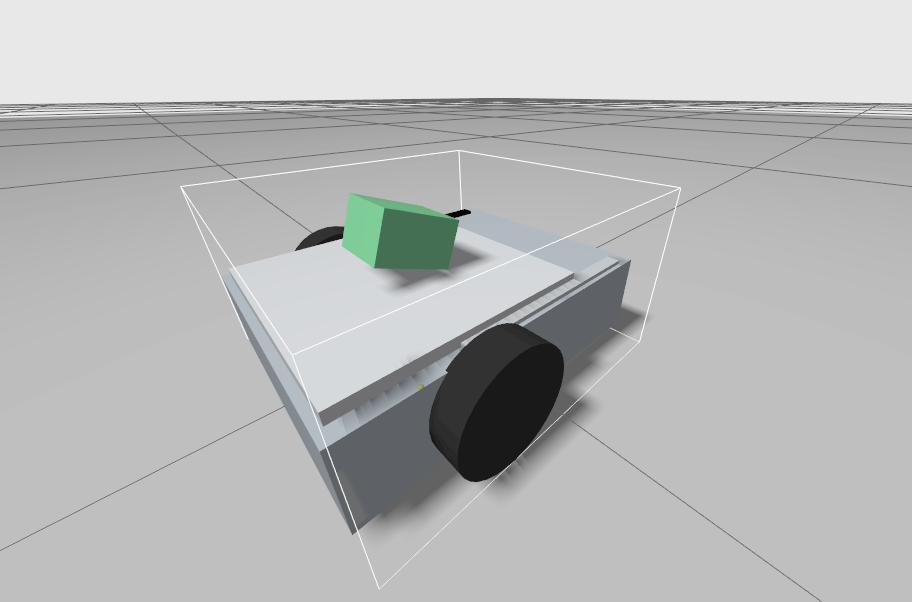

# Simulation FootBot — ROS 2 + Gazebo 🤖⚽

[English](../../README.md) · [Español](../es/README.md) · [Français](README.md)

> Migration « simulation-first » de FootBot utilisant **ROS 2 Humble** et **Gazebo
> Fortress**. Cette couche garde disponibles comme références les anciennes apps
> ESP32 et Python, tout en ajoutant l'apparition (spawn) du robot, des données de
> caméra simulée, le contrôle natif ROS, la perception de foot et des expériences
> autonomes de contrôle de balle.

<p align="center">
  
</p>

**Figure 1.** FootBot apparu dans Gazebo avec la caméra simulée du robot,
l'éclairage et les objets de validation visibles.

---

## En un coup d'œil

- 🤖 **Modèle du robot :** modèle Xacro de FootBot avec roues, roue folle (caster), caméra et plugins Gazebo.
- 🎮 **Contrôle :** `/cmd_vel`, HTTP `/move` historique, et contrôle par gestes natif ROS.
- 👁️ **Perception :** caméra simulée, détection HSV de la balle, plomberie (plumbing) du détecteur YOLO et outils de datasets.
- ⚽ **Mondes de foot :** tests de caméra, scénarios de contrôle de balle, tests multi-couloirs, buts, murs et équipes.
- 🧠 **Autonomie :** FSM déterministes de Contrôle de balle et de Reach Goal ; voler la balle et la stratégie d'équipe sont seulement prévues.

> **Règle de contrôle :** n'exécutez qu'un seul propriétaire de `/cmd_vel` à la fois.

---

## Table des matières

- 📚 [Index des docs](README.md)
- 🚀 [Configuration](setup.md)
- 🧱 [Workspace](workspace.md)
- 🧭 [Architecture](architecture.md)
- 🎮 [Modes de simulation](modes.md)
- ⚽ [Contrôle de balle](ball-control.md)
- 🥅 [Reach goal avec la balle](reach-goal.md)
- 👁️ [Perception et datasets](perception-and-datasets.md)
- 🌍 [Mondes et scénarios](worlds-and-scenarios.md)
- 🧪 [Dépannage](troubleshooting.md)
- 🛠️ [Guide de développement](development-guide.md)
- 🗺️ [Étapes de foot prévues](planned-soccer-stages.md)

---

## Démarrage rapide

```bash
cd /media/josedanielchg/Data/Proyectos/Robotica/footbot/simulation/ros2_ws
source /opt/ros/humble/setup.bash
colcon build --symlink-install
source install/setup.bash
```

Simulation de base :

```bash
ros2 launch footbot_bringup spawn_footbot.launch.py
```

Exemple actuel de contrôle de balle autonome :

```bash
ros2 launch footbot_bringup ball_control.launch.py scenario:=front show_debug_view:=true
```

Scène de vision reach-goal :

```bash
ros2 launch footbot_bringup reach_goal.launch.py show_debug_view:=true
```

Aperçu du terrain de foot :

```bash
ros2 launch footbot_bringup soccer_field.launch.py
```

Préparation du dataset YOLO :

```bash
python3 simulation/ros2_ws/src/footbot_soccer_vision/datasets/validate_yolo_dataset.py \
  --dataset-dir simulation/ros2_ws/src/footbot_soccer_vision/datasets/exports/reach_goal_ball_goal_v1 \
  --require-splits train val
```

Voir les [modes de simulation](modes.md) pour le reste des commandes de lancement.
