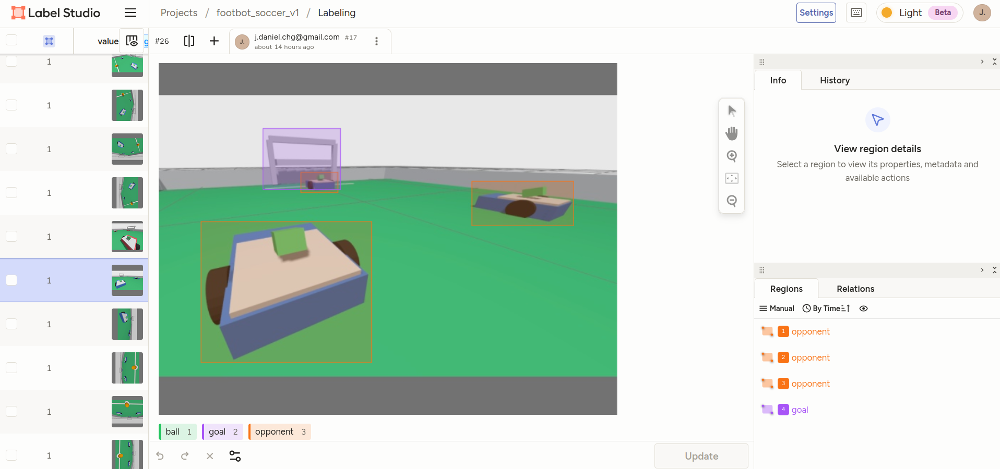

# Perception et datasets

<p align="center">
  
</p>

**Figure 1.** Vue de débogage du contrôle par gestes natif ROS avec les landmarks
de main de MediaPipe, la direction et le retour de vitesse.

## Topics de caméra

Caméra simulée du robot par défaut :

```text
/camera/image_raw
/camera/camera_info
```

Caméra de gardien du terrain de foot :

```text
/soccer/camera/image_raw
/soccer/camera/camera_info
```

## Détection HSV de la balle

`footbot_perception` fournit `ball_detector`, qui publie :

```text
/ball_detection
/ball/debug_image
```

Ce détecteur est déterministe et réglé pour la balle orange simulée.

## Vision de foot par YOLO

`footbot_soccer_vision` fournit :

```text
opponent_detector
goal_detector
image_capture
```

Sorties par défaut :

```text
/opponent_detections
/opponent_detection/debug_image
/goal_detections
/goal_detection/debug_image
```

Les détections utilisent `vision_msgs/msg/Detection2DArray`.

Les détections balle/but de reach-goal utilisent :

```text
/soccer/detections
/soccer/detections/debug_image
```

Exécutez la scène de vision Reach-goal à un robot :

```bash
ros2 launch footbot_bringup reach_goal.launch.py \
  model_path:=/media/josedanielchg/Data/Proyectos/Robotica/footbot/simulation/ros2_ws/src/footbot_soccer_vision/models/reach_goal_ball_goal/reach_goal_ball_goal_v1_best.pt \
  target_classes:=ball,goal \
  show_debug_view:=true
```

Si vous utilisez `soccer_field.launch.py` directement, passez
`image_topic:=/soccer/camera/image_raw` au détecteur YOLO ; sinon, la fenêtre
d'image de débogage restera noire car le détecteur écoutera le mauvais topic de
caméra.

Installez les dépendances YOLO optionnelles :

```bash
python3 -m pip install --user -r simulation/requirements-yolo.txt
```

Les poids du modèle sont ignorés par Git. Placez les poids locaux sous :

```text
simulation/ros2_ws/src/footbot_soccer_vision/models/weights/
```

## Capture de datasets

```bash
ros2 run footbot_soccer_vision image_capture \
  --ros-args -p image_topic:=/camera/image_raw
```

Les images et étiquettes générées sont ignorées par Git.

<p align="center">
  
</p>

**Figure 2.** Vue du projet Label Studio avec les objets de foot étiquetés pour
l'entraînement YOLO, incluant les boîtes `ball`, `goal` et `opponent`.

## Augmentation conservatrice

Pour 40 originaux, crée 40 originaux copiés plus 120 images pivotées/assombries :

```bash
python3 simulation/ros2_ws/src/footbot_soccer_vision/datasets/augment_dataset.py \
  --input-dir simulation/ros2_ws/src/footbot_soccer_vision/datasets/raw/soccer_v1/images \
  --output-dir simulation/ros2_ws/src/footbot_soccer_vision/datasets/raw/soccer_v1/augmented_images \
  --output-size 640 640 \
  --rotation-angles 90 180 270 \
  --brightness-factor 0.85 \
  --copy-originals \
  --clean-output
```

La sortie reste non étiquetée. Étiquetez manuellement les images générées avant
l'entraînement YOLO.

## Préparation de l'entraînement Reach Goal

Placez les exports YOLO de Label Studio sous :

```text
simulation/ros2_ws/src/footbot_soccer_vision/datasets/exports/
```

Préparez un dataset `ball` + `goal` :

```bash
python3 simulation/ros2_ws/src/footbot_soccer_vision/datasets/prepare_reach_goal_dataset.py \
  --input-dir simulation/ros2_ws/src/footbot_soccer_vision/datasets/exports/soccer_v1_labelstudio_yolo \
  --output-dir simulation/ros2_ws/src/footbot_soccer_vision/datasets/exports/reach_goal_ball_goal_v1 \
  --classes ball goal \
  --copy-images \
  --seed 42
```

Validez-le :

```bash
python3 simulation/ros2_ws/src/footbot_soccer_vision/datasets/validate_yolo_dataset.py \
  --dataset-dir simulation/ros2_ws/src/footbot_soccer_vision/datasets/exports/reach_goal_ball_goal_v1 \
  --require-splits train val
```

Entraînement à blanc (dry-run) :

```bash
python3 simulation/ros2_ws/src/footbot_soccer_vision/training/train_yolo_reach_goal.py \
  --config simulation/ros2_ws/src/footbot_soccer_vision/training/configs/reach_goal_ball_goal.yaml \
  --dry-run
```
