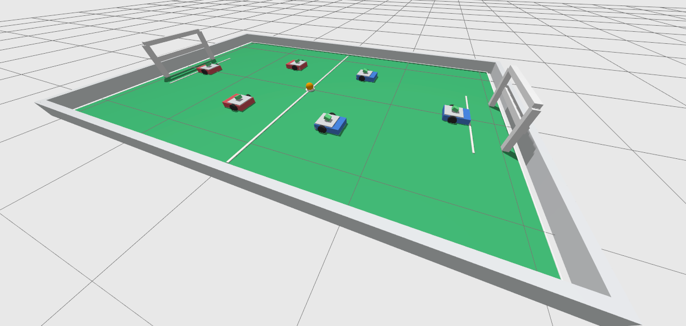

# Mondes et scénarios

Les mondes Gazebo se trouvent dans :

```text
simulation/ros2_ws/src/footbot_gazebo/worlds/
```

<p align="center">
  
</p>

**Figure 1.** Monde du terrain de foot avec des murs de délimitation, deux buts,
une balle centrale et des équipes de robots en miroir.

Mondes importants :

| Monde | Rôle |
| --- | --- |
| `footbot_empty.sdf` | Monde minimal. |
| `footbot_camera_test.sdf` | Objets colorés pour la validation de la caméra. |
| `footbot_ball_follow.sdf` | Scène de test du suiveur de balle simple. |
| `footbot_ball_control.sdf` | Un robot plus des scénarios de balle dynamique. |
| `footbot_ball_control_multi.sdf` | Trois couloirs isolés de contrôle de balle. |
| `footbot_reach_goal.sdf` | Un robot, une balle dynamique et un but pour la validation de la vision et du comportement de Reach Goal. |
| `footbot_opponent_detection.sdf` | Espaces réservés (placeholders) pour la détection d'adversaires. |
| `footbot_soccer_field.sdf` | Terrain complet avec murs, buts, balle centrale et disposition d'équipe de trois robots en miroir. |

Validez les mondes :

```bash
ign sdf -k simulation/ros2_ws/src/footbot_gazebo/worlds/footbot_ball_control.sdf
ign sdf -k simulation/ros2_ws/src/footbot_gazebo/worlds/footbot_soccer_field.sdf
```

## Balle dynamique

Le modèle de la balle orange se trouve dans :

```text
simulation/ros2_ws/src/footbot_gazebo/models/orange_ball/
```

Il utilise la friction, un rebond réduit, une décroissance de la vitesse et le
plugin personnalisé `footbot_ball_drag_system` pour que la balle ne roule pas
indéfiniment après le contact.

## Modèle du robot

Le modèle du robot est généré à partir de :

```text
simulation/ros2_ws/src/footbot_description/urdf/footbot.urdf.xacro
```

Frames importants :

```text
base_footprint
base_link
left_wheel_link
right_wheel_link
camera_link
camera_optical_frame
caster_link
```
